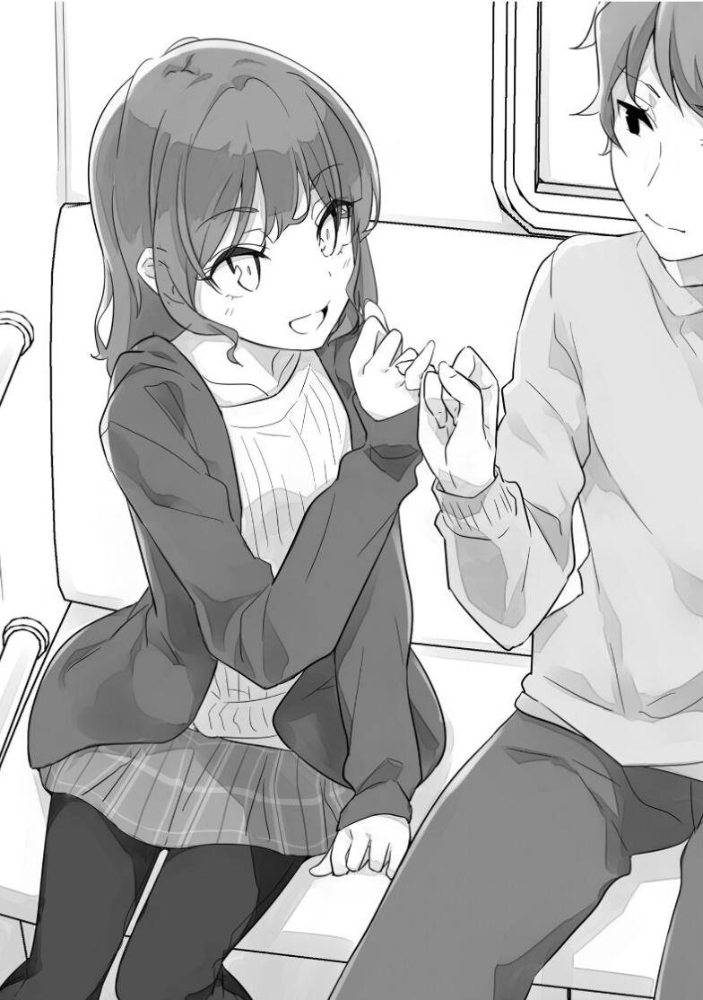

# 第二章 秘密与约定

### 1

12月24日。

今天是平安夜。这天早上咲太起的比平时晚一些，早上八点过才被那须也踩脸踩醒。

要是大学第一节有课，那这个点才起来就铁迟到了。但咲太今年的课前天就已经全都上完了。下次上课要等到新的一年。所以咲太现在实质上已经开始放寒假了。

所以咲太可以尽情在温暖的被窝里睡懒觉。可以尽情接受回笼觉的诱惑。不用上学，也没有打工的安排。但咲太还是选择了起床。这时因为他和人约好了一件重要的事情。

「好冷」

冰冷的空气让咲太在走出房间的同时打了个寒战。

来到客厅里，咲太首先给那须也倒上了猫粮。猫粮哗啦哗啦地落到了它的饭盆里。

接着用烤面包机烤起土司，然后给灶点上火，一边煎蛋一边煎香肠。

咲太在那须身边享用了内容固定的早餐。

迅速收拾好餐具后，打开了洗衣机。

在等待期间，咲太回到客厅打开了电视。咲太不怎么在这个时间段看电视，所以不知道哪个台在播什么节目。于是随手把台换了一圈，这时候花枫睡眼惺忪地从房间里走了出来。

「哥哥，早上好……」

「早饭怎么说？」

「我要吃」

花枫一边打哈欠一边坐到了餐桌前。

咲太把刚才顺手多煎的一份简单和香肠端到了她面前。

「我想喝热可可」

咲太用印着熊猫图案的马克杯冲好热可可，然后把烤好的土司盖在杯子上给花枫端了过去。

这时花枫已经吃完了煎蛋和香肠，她开始把土司撕碎沾着热可可吃。她的表情看起来很享受。

「你几点出门？」

她之前说，她今天要和她的朋友鹿野琴美一起去观看『甜蜜子弹』的圣诞演唱会。演唱会结束后她会去横滨，回那边的家和爸爸妈妈一起吃蛋糕。

「十点过吧。午饭和小琴一起吃。你呢？」

「我中午的样子吧」

正聊着，洗衣机的提示音响了起来。

「帮我跟爸妈说，我过年会回去一趟」

咲太一边往盥洗室走，一边对花枫这么说道。

「好」

从背后传来了花枫的声音，她嘴里包着土司，声音有点瓮。

在那之后，咲太晒了衣服，打扫了房间，接着送走了花枫。最后做好了自己出门的准备，在正午过后一点点出了门。

「拜托你看家了，那须也」

那须也原本在洗脸，它喵了一声送别咲太。

咲太出门来到了藤泽站。这里是神奈川县藤泽市的中心，JR线，小田急线，还有江之电在这里交汇。

车站前的景象咲太再熟悉不过。但今天却有一点点不同。路上的行人似乎要比平时多一些。

而且还有很多人提着装礼物的小袋子。有很多人打扮得比平时更加用心。

今天市圣诞前夕，路上的行人营造出了节日的氛围。咲太在车站北口的立体人行道上，看到了这片景象。

某家电商场门口有个小广场，很适合驻足。这里有不少男男女女在等人。咲太也是其中一个。

他们一个接一个等到了自己约的人，开开心心地往检票口走去。有些人牵着手，有些人挽着手臂，有些人很紧张，刻意拉开点距离……他们都享受着今天这个日子。

广场上伫立着的大钟指向了12点29分。

离约好的时间还有一分钟。

咲太紧紧盯着分针。

「久等了」

这时，有人从背后冲咲太这么说。

咲太回过头去。

便看见了一位比自己小一些的女生。

她是姬路纱良。

她穿着白色针织衫，外面套着巧克力色的外套，下半身是深灰色方格裙。天气这么冷她还是光着腿，很是耀眼。脚上穿着黑色的短靴。整体色调偏暗，唯独一条鲜红色的围巾充满了圣诞气息。

原本在咲太旁边玩手机的男人不加掩饰地冲着纱良看了又看。他心里多半在想『这妹子可以啊』。

「请发表你的感想」

纱良的表情显得有些调皮。她这是在要求咲太给出『你真可爱』，『你穿这身真漂亮』这样的回答。

「我看着都冷」

咲太看着她的腿，说出了自己的真实想法。是真的看着都冷，咲太看见她真的打了个激灵。

「你说话一定要这么损吗。那你倒是来帮我挑衣服啊」

纱良做作地鼓起了脸颊表示生气。她的目光充满了挑衅。

「那我就恭敬不如从命」

「哎？」

「傍晚还会更冷。先去趟商店给你买点东西防寒吧」

咲太一边说着，一边朝着站前大楼走了过去。那里面有服装店。

「你，你认真的？」

纱良跟了过来，但她只不过是开个玩笑，所以显得有些疑惑。

「你穿成这样我是真看着冷」

这是咲太的真心话。

「我不是这个意思。你明明知道，还故意答非所问」

咲太快步走进了大楼，不去理睬纱良那些抱怨。咲太和纱良花了大概三十分钟买完东西后，来到江之电藤泽站，坐上了前往镰仓的电车。

两人并排坐在靠角落的座位上。

电车开了起来。纱良恨恨地看着自己的双腿。她把腿打得笔直。腿上穿着黑色的贴腿牛仔裤。

「把你的大长腿收一收，这样会挡到路」

听到咲太的提醒，纱良默默地把腿收了起来。

「我一周前就费尽心思想好了今天要穿什么」

纱良现在的语气就像是在学会上做发表一样。

「那你应该在做选择的时候考虑到今天的气温」

电车在临站稍作停靠，然后又行驶了起来。

「我觉得你应该是会喜欢短裙加裸腿的那种人啊」

「那我当然喜欢。但总不可能因为我喜欢就让学生着凉感冒」

「我又不会感冒」

「请说明你的根据」

咲太用考试问题的格式向她问道。

「因为平时穿的校服裙子更短」

纱良也故意用答题的格式开始证明自己的正确性。

她的目光看向了一名站在门边上的女高中生。那个女生恰好就穿着短裙光着腿。

「你看那么穿难道不冷么？」

「当然冷啊」

「我想也是」

咲太甚至见过树里在裙子下面再穿一条运动裤。但纱良从来不会这么做。想来也是为了可爱度不要温度的年纪。

电车在七里浜站停了车。这里是离峰之原高中最近的车站。这所高中是咲太的母校，同时也是纱良现在就读的高中。好几名穿着校服的学生在这一站下了车。拿着个大包的应该是排球社的成员。看来就算是在圣诞前夕，他们依旧要参加社团活动。

车门关闭，电车再次行驶起来。

驶过道口，缓缓前行，在稻村崎站停了车。等到开往藤泽的电车通过之后，再次行驶起来。

看向窗外，时不时能从房屋的缝隙之间看到海。

这种时候，咲太总会看着窗外寻找海的身影。但还没等到下一个能看见海的缝隙，电车就在极乐寺站停了下来。这个车站很安静，非常契合这个站名。在这里上下车的人也很少。

「咲太老师。你还记得我们的约定吗」

纱良在寂静的车厢里开了口。她的语气和之前不太一样。

「嗯？」

「你和我说好了，不会治好我的青春期综合征」

「我记得啊」

「但你是个骗子，我不放心」

纱良一边笑着这么说，一边把自己的小指伸到了咲太面前。这是在要求咲太和她拉勾。

「……」

<figure><figcaption></figcaption></figure>

咲太默默地用自己的小指勾住了她的小指。车门关上了。车长在广播里说了句『电车即将发车』，接着电车就开了起来。周围突然变得很暗。这是因为电车驶入了隧道。极乐寺站和长谷站之间这座隧道是江之电行驶路线上唯一的隧道。

外来的光线被遮挡，电车行驶的声音在隧道里回荡。

「拉勾勾」

纱良用只有自己和咲太能听见的声音念起了口诀。

「说谎的人」

同时电车在隧道里行驶，朝着前方的光亮前进。

「要吞千根针」

快到出口了。

「拉上了」

光渐渐照进了车厢，同时纱良也说完了最后一句口诀。

咲太的小指和纱良的小指分开了。电车穿过隧道后，羡慕的阳光照了进来。咲太被晃到眼睛，忍不住闭上了眼。接着整个视野变得一片白。咲太觉得有些不可思议，这时他的意识也开始模糊起来。

就在感到不对劲的这一瞬间，他醒了。

睁开眼第一时间看到的是自己的右手。刚才还在用右手跟纱良拉勾。然后看到了那须也的脸。它正在舔咲太的小指。那须也背后，是熟悉的白色天花板。自从搬到藤泽来之后，每天醒来都会看到这个天花板。

「原来刚才是在做梦……」

咲太撑起身子，觉得难以置信。床也好，床单也好，书桌也好，窗帘也好……一切都证明，这的确是咲太的房间。

枕边的时钟也的确显示着12月3日。

「这里真的是现实吗？」

那须也抬头望着咲太，它自然不会给出答案，只是打了个大大的哈欠。

### 2

「梓川，你把这桌收拾完就可以休息了」

咲太正端起原本装汉堡肉的铁盘和装饭的餐盘，就听见店长在身后对自己说了这么一句话。店长正在做酒精消毒。

午餐时间的高峰期过去了，家庭餐厅里多出了不少空位。

「那我先去休息了」

「哦，对了，你等下」

咲太正打算端着餐具回后厨，却又被店长叫住了。店长好像又想起了什么，咲太总不能当没听见。

「还有什么事吗？」

「圣诞节你能来上班吗？24日25日随便哪天都行」

「不好意思，我两天都有安排」

「哎，我就知道。毕竟是圣诞节」

「对不起」

咲太再次低头表示歉意，然后就去了后厨。

把餐具交给在洗碗处打工的大妈，然后倒了杯供应给工作人员的茶，端去了休息室。

把杯子放到桌子上，就看到桌子上贴着一张传单，上面写着『紧急招工！有圣诞节补贴！』。后面还加了句『附赠蛋糕』。看得出来店长是真的很急。

「圣诞节……」

咲太坐到钢管椅上，沉思起来。

今年的圣诞节究竟会怎么过。

直到昨晚，咲太都还可以幻想和麻衣度过一个甜蜜的圣诞节。

但今早坐的那个梦无疑是给咲太破了一盆冷水。

如果那只是个梦，咲太自然不会往心里去。但这梦还真不好不当回事。

因为这个梦，很有可能是预知梦。

纱良来到补习班这个梦就成真了……今天做的这个梦，跟那个梦完全是同样的感觉。醒来的时候才注意到那是在梦里。

如果今早坐的那个梦也会变成现实，那就会有很多问题。

首先，12月24日咲太没跟麻衣在一起。明明昨晚刚约好了要去旅游……

不知道为什么，当天和咲太在一起的是刚成为咲太学生的姬路纱良。

而且，纱良还说出了很让咲太在意的话。

——你和我说好了，不会治好我的青春期综合征。

咲太不知道自己为什么会和她做这样的约定。至少现在咲太还没有跟她做过这样的约定。但她那段话里包含着一个信息。

就是她患上了青春期综合征。

她自己承认了这一点。

「这下麻烦了」

咲太下意识地自言自语了起来。

「前辈你有麻烦了？」

没想到自言自语竟然得到了回应。这时朋绘正好换好服务生制服从女更衣室出来。

「我做了个奇怪的梦」

「哎？你也做了？」

朋绘显得有些吃惊。

「你会这么问，说明你也做了那种梦对吧」

朋绘看了眼打卡器，上面显示现在是两点五十五分。于是她走进了休息室，坐到了咲太对面。

「不是我。是奈奈」

奈奈是指她的朋友，米山奈奈。

她说她今早做了个很真实的梦。

朋绘把手机放到了桌子上。

「什么梦？」

「我想想……好像跟你说了也没什么问题。正好我也有点事想问你」

她刚才好经历了一番思想斗争。

「奈奈交到男朋友了。这个之前我跟你说过对吧？」

「我记得你当时说，她和她中学同学走到一起了」

「嗯。然后……」

朋绘有些支吾其词。她尴尬地扭开了头。

「然后？」

「她做了个梦。梦见了圣诞前一天的情形」

「圣诞前一天」

和咲太梦见的是同一天。这真的是巧合吗。

「她说在梦里，她和男朋友接吻了」

朋绘说完后瞪了咲太一眼。搞得好像咲太做错了什么似的。

「怎么接吻的？」

「你这是什么问题？！」

「是气氛恰到好处，还是对面强求的」

如果是后者，那事情就有点不一样了。

「是她主动的」

「米山挺行的嘛」

「她今天就在跟我说这个事。她说如果这个梦真的像那些『#做梦』推文一样成真的话，她会不知道该怎么办……」

朋绘看起来有点不淡定。她把放在桌子上的手机又拿了起来，紧紧握住。

「学长你觉得她该怎么办？」

「我觉得亲就亲呗」

「但她很担心，她身为一个高三学生这么做是否有不妥……」

朋绘打开手机操作了起来。她大概是在确认她和奈奈的聊天记录。

「我去年跟麻衣同学还是亲热过的，虽然很有节制就是了」

「别把奈奈和你相提并论」

「觉得内疚的话就化内疚为动力，加倍努力学习不就好了」

咲太当时可是被麻衣盯着强制学习的。虽然是打大棒的同时也发糖果，但大棒和糖果的比例是一百比一……

「说得也是」

看来朋绘心里也是这么想的。但她又不想不负责任地把自己的主观想法告诉朋友，所以才想到和咲太商量。

朋绘已经在手机上打起了字。

「我想米山也是希望得到肯定的答复才会跟你商量」

「你这句话是多余的。啊，她回我了，她说『谢谢你的建议，我会努力的』」

这个努力，是指学习努力还是恋爱努力。或许是都有吧。

「说起来，没想到还真有这么多人信『#做梦』啊」

「最近学校里也有很多人在谈论这个」

「这样啊」

至少现在咲太没有因此遇到什么不愉快的事。但咲太有种直觉，这种直觉告诉他，让这个传闻继续广泛传播下去会有不好的事发生。这事越传越真，到时候要是所有人都相信了，那它可能就不仅仅是一个超自然传闻了。

因为如果预知到了不好的未来，大部分人是会想去改变的。

现阶段想这些或许是想得有点多了。

「那你做了什么梦？」

「刚听了米山那个青涩的梦，我有点不好意思说了啊」

要是跟朋绘说，自己在梦里跟纱良约了会，天知道朋绘会说什么。反正可以确定她会骂人。

「你还有不好意思的时候啊」

朋绘轻描淡写地说出了一句很伤人的话，同时看向了手机。她滑动着手机频幕，或许是收到了新信息。接着她突然抬起头来警觉地看着咲太说。

「前辈，你对姬路做了什么？」

朋绘说出了一个让人意外的名字。咲太现在正好很关注这个名字。

「什么都没做啊。不过这个月她开始来我这里上课了」

咲太陈述了事实。现在咲太和纱良只是普通的师生关系。这是真的。

当然，要是那个梦成真，今后说不定会发生一些改变……

「那她找我要你电话，可能就是为了这事吧」

朋绘把手机递了过来。

「说起来，我好像还没告诉他我没有手机」

「那我告诉她我现在正在家庭餐厅和你一起打工没问题吧？」

「行。麻烦你了」

听到咲太的答复后，朋绘把手机收了回去。

「你打工到几点？」

「九点」

「她让我问你打完工有没有时间」

咲太正打算回答，

「还说她会在自习室一边复习一边等你」

朋绘就接着念出了下一条消息。

「行吧」

正好咲太也有事想问她。关于那个梦，还有青春期综合征。今天能见到她是件大好事。

「她还跟您说『咲太老师，我等你哟』」

朋绘的语气突然客套了起来。她脸上的表情看起来不太高兴，眼神里写着『我对你有意见』。

「咋了？」

「没咋～」

朋绘回了充满言外之意的两个字，然后站了起来。快到上班时间了。

「姬路很受欢迎。你自己小心点」

不等咲太问自己该小心什么，朋绘就已经走向了大堂。

### 3

咲太打完工，从家庭餐厅里出来的时候是九点零五分。因为知道纱良在等自己，所以咲太今天选择了九点准时打卡下班。打完卡后迅速换好衣服往外走，路上没遇到一个同事说一句『我先走了』。

走向车站，沿途的道路都已经被装扮成了圣诞风格。没走几步，就听到背后有脚步声。脑子里冒问号的时候背后的人就已经整个人扑了上来。同时还用带着毛线手套的手遮住了咲太的眼睛。

「猜猜我是谁」

咲太认识一个爱搞这种恶作剧的人。咲太第一时间想到了她，但她现在远在冲绳。而且要真是她，咲太一听声音就认出来了。

咲太稍微想了一想。但需要想这件事本身就给了咲太答案。

「是偷懒不复习考试的姬路」

「很遗憾，你猜错了」

声音的主人松开了手，有点不开心地这么说道。同时她把身体也从咲太身上挪开，从咲太背后绕到了咲太跟前。

「正确答案是，复习累了出来小憩一下的我」

纱良脸上带着笑容。皮这一下她似乎很开心。

「原来你也会搞这种小孩子恶作剧啊」

纱良在同龄人中属于比较靠谱的。咲太觉得她沉得住气，比较成熟。所以她刚才的举动让咲太感觉有些意外。

「我就是小孩子啊。比你小整整三岁呢」

她用手比了个三。

「我倒是觉得，能说自己是小孩子的人都挺成熟的」

至少，纱良刚才的言行举止都带有利用小孩子这一身份的意图。

「那你觉得我很成熟咯？」

「我觉得你就是典型青春期」

咲太刻意说出这个词，来探她的口风。如果她和梦里一样患上了青春期综合征，并且自己通过症状了解到了这一点的话，那么她或许会对这个词产生一些反应。

但纱良却一点调调都没变。

「你说得对。确实是青春期」

她只是坦率地承认。没有一点戒备。没有惊讶，没有困惑，也没有焦急。一直是一张柔和的笑脸。这样什么都看不出来。看来只有从别的方向试探了。

「对了。我书包放自习室里了」

「那我们先去趟补习班吧。呆在这里怪冷的」

「好」

时间已经到了晚上九点半，课外培训机构却还是灯火通明。在学校这是不可能的。但在补习班是理所当然。但今天毕竟是周六，感觉人比平时少些。

「教室里会有人吗？」

「现在应该没在上课了」

「那我先去那下包，你在教室等我一下」

纱良去拿包了，咲太照她说的进了教室。前几天还在这间用隔板隔出来的小教室里上过课。说是教室都是给面子了，其实就是摆了几张桌椅摆了个白板的小隔间。

咲太来到了白板前，纱良拿着包进了教室。

纱良很自然地抽出一张椅子，坐到了桌前。两人之间的位置关系和上课的时候完全一样。唯一的区别在于现在她没有在桌子上摆学习用具。

「没有其他人，感觉还有点小兴奋」

纱良探出身子靠近咲太，像是在说悄悄话。声音也自然变小了。

平时前后左右总有老师讲课的声音或是学生提问的声音。现在这些声音钱都没有，咲太也觉得挺新鲜的。

「你找我是因为期末考试有题不会？」

咲太教的是数学，数学在第一天考……也就是说昨天已经考完了。

「考试完全没问题。真的是你讲哪考哪」

「那看来山田同学也有希望了」

「但愿吧」

纱良有些打趣地笑了起来。他和健人同班，或许知道他的情况。怕不是健人考完之后说了『完蛋了……』之类的话。还真有可能。已经可以想象他那样子。让咲太不禁悲从中来。

「考试没问题，那你找我是……？」

咲太带着疑问望着纱良。

「咲太老师……你知道『#做梦』吗？」

「最近常听人说」

今天打工的时候还在跟朋绘聊这个。

「今天早上……我做了个奇怪的梦」

「这样啊……奇怪的梦」

咲太没想到会是这个情况。但仔细想想，这种可能性好像挺大。

「我梦见了圣诞节前一天的事……」

「嗯」

「那一天我和你在一起……」

「……」

「我觉得，大概是在约会」

到这里为止，梦的内容都和咲太做的梦一样。

「然后我会在江之电车上和你拉勾？」

「哎……？」

「在极乐寺站那一段」

「哎？！」

听到咲太这些话，纱良显得很吃惊。

「……难道，你也做了同样的梦？」

她这句话肯定了咲太的疑问。

「是的。看起来梦见的是同一天」

「不是吧。真的会有这种事？」

纱良的声音听起来很兴奋。看来她的好奇心盖过了惊讶与担忧。

「大概是真有吧。毕竟都实际发生了」

如果那个梦真的是预知未来……那么两个当事人做的梦内容肯定是必须一致的。要是当天在那个时间段，其中有一个人在别的地方做别的事，那就对不上了。

如果那个梦真的是咲太和纱良的未来，那么有些事必须先问清楚。

「我有件事想问你」

「关于青春期综合征？」

这次纱良抢先一步说了出来。

「没错。在梦里你说我和你约好了不治好你的青春期综合征。你是真的患上吗？」

「是的。我真的患上了青春期综合征」

纱良干脆地承认了。她笑得很轻松。完全感觉不到她有任何困惑和自卑。像个没事人一样。就像是在问一个人『你是不是在练钢琴？』她回答『是呀』这么轻松。

「什么症状？」

「这个是秘密」

她语气没变，但这次却拒绝回答。

「什么时候开始的？」

「黄金周过后的第一个早上」

这个问题她倒是回答了。而且还相当精确。现在已经十二月了。黄金周是在半年多之前。她记得这么清楚，就说明当时肯定有什么事让她印象深刻。

「当时你遇到什么不开心的事了吗？」

「我当时失恋了」

这个问题纱良也回答了。表情依旧若无其事。

「你别误会，不是交往中被人甩了那种失恋。也不是告白被拒绝」

不等咲太开口，纱良就补充了这么一句。

「是喜欢的人已经有心上人了这种剧情对吧」

「别说什么『剧情』好吗」

咲太说中了，但用词有点偏僻。纱良对此表现得有点害羞有点不开心。

「但我看你现在不像是有什么烦恼的样子啊」

「是的。我已经走出来了」

她的表情不像是在说谎。也不像是在逞强。她依旧是那种对自己的想法很有自信的态度。

「多亏患上了青春期综合征，我一切都看开了」

所以咲太觉得这是她的真心话。

但也正因如此，咲太对一件事抱有疑问。她自己都这么明确地说自己『看开了』，那她为什么至今身患青春期综合征呢？唯独这一点想不通。

「现在我每天都很开心。所以，就跟我在梦里说的一样……请不要治好我的青春期综合征」

「你看我像会治这种怪病的医生吗？」

「一点也不像」

纱良笑出了声。

「你觉得我在梦里为什么会那么说？」

「我咋知道」

「对了，这件事麻烦你不要告诉别人。这是属于我们的秘密」

纱良突然想起这事，开始要求咲太保密。

「这件事？」

「麻烦你不要明知故问。当然是我有青春期综合征这件事」

「我不会告诉别人的」

「真的吗？」

纱良收起了笑容，一脸严肃地抬头看着咲太。

「真的。我说出去也没人信。他们只会觉得我脑子有毛病」

听到咲太给出了合理的解释，纱良笑着说了句『想想也是』。

「而且我都不知道你什么症状，怎么好跟人乱讲」

咲太再次绕着弯子询问她的症状。

「你想知道？」

她准确地察觉到了咲太的意图。

「无所谓吧，只要对我无害就行」

这里欲擒故纵。

「咲太老师，你应该对学生更关心一点才对」

「但我关心了你也不会告诉我」

「那我就给你留个作业吧。你回去想想，我的青春期综合征到底是什么症状」

「我很讨厌做作业的」

「这学期结束后，记得把答案交上来」

「做了作业会有什么好处？」

「我想想……如果你答对了，我就答应你一个要求」

她想了一想，然后对咲太抛出了一个俏皮的笑容。

「那我很期待」

「不准提色色的要求」

纱良又笑了起来。这时她包里的手机响了。

「哎呀，都这么晚了」

已经快十点了。

「妈妈来车站接我了，我先走了」

纱良慌忙站起身来，一边接电话一边背起了包。

「喂，妈。我还在补习班，马上过去」

纱良顾自说完重点就挂断了电话。她在走出教室的时候还回头看了咲太一眼说。

「别忘了做作业」

她带着轻松的笑容嘱咐咲太。咲太做出一脸极不情愿的表情。她看见咲太的表情就满足了，一路小跑离开了教室。

「别在走廊里跑动」

咲太做个样子提醒了一声，话没说完她都已经没影儿了。

「……」

咲太独自留在了这里。

「感觉这事怪起来了啊」

别说进展了。问题反而越来越多。完全不知道接下来会是什么情况。

「……总之先回家吧」

呆在这里什么都解决不了。只有这一点是明确的。

咲太不紧不慢地穿过纱良刚才跑过的走廊，来到办公室前的休息区。柜台里面就是办公室，里面还有讲师在办公。

咲太也不想打扰到他们，于是用他们不一定听得见的音量说了句『我先走了』，接着就走了出去。

咲太按下了电梯按钮。电梯本来就在往上走，所以不到十秒就来到了咲太面前。电梯铃响，门打开了。

「嗯？！」

电梯里传来了惊讶的声音。

电梯里居然有人，而且会惊讶就说明对方认识咲太。于是咲太立刻把自己的疑问问了出来。

「双叶，你怎么来了？」

坐电梯上来的是理央。

「我昨天忘东西在这里了」

理央走出电梯，像是在找借口一样说出了理由。

「很少见你忘东西」

而且特意在这个时间来取也有点反常。

「你又是为什么会在这里」

「我在这里你有什么不方便吗？」

理央的语气听起来带着点责备。

「我有点事。既然遇见你了那正好，有事想找你商量。接下来有空吗？」

现在时间不早了。能在这种时候碰到理央是很幸运的。

「那你等我一下。正好……我也有事想找你商量」

理央会找人商量事。这也很反常。

理央很快就从更衣室出来了。她手上多了件灰色的外套。

「你忘的就是这个？」

「少问两句，走了」

理央无视咲太的问题，走进了电梯。在这个季节忘记外套有点离谱。看来昨天真有些不同寻常的事。

所以理央才会说想找咲太商量。

咲太和理央走出补习班，走向车站南侧。沿着江之电铁路走了一会，来到了一家汉堡店。这家店提供酒精饮料。店里已经有其他两桌客人在喝酒欢谈了。

咲太饿了，于是点了这家店的招牌汉堡。等了不一会儿，载着厚实汉堡的铁盘就被端了上来。理央只点了杯拿铁，咲太当着她的面大口啃起了汉堡。理央的目光显得很无语，就像是在说『真佩服你能在这个时刻吃得下卡路里这么高的东西』。

吃完汉堡后，咲太一边吃着薯条，一边跟理央说了今天发生的事。

自己做了个梦。

梦里自己跟纱良在一起。

她在梦里说她患上了青春期综合征。

咲太刚才跟她聊过，确认了这件事属实。

咲太把一切都告诉了理央。

「所以你转过头就毁约，把人家的秘密告诉了我？」

理央叹了口气这么说到。

「谁叫我是骗子呢」

「这个我很清楚」

「于是你什么看法？」

「总之，你这个梦就说明了樱岛学姐为什么会危险，不是吗？」

「有吗？」

咲太完全搞不懂理央是什么意思。

「危险就是指你搞外遇，然后樱岛学姐把你给一刀捅了啊」

「……确实，这也可以说是『麻衣同学危险』」

但这样就和『去找雾岛透子』联系不起来了。

「玩笑先放一边」

「我怎么感觉这事放你这不一定是玩笑呢」

理央的语气很认真。

「你真的觉得我会鸽了和麻衣同学的温泉旅游，跑去跟姬路约会？」

「如果只是单纯的约会，那肯定是不会的」

「那肯定啊」

「但如果这是为了治好她的青春期综合征，那可就不好说了」

「如果姬路的青春期综合征会威胁到麻衣同学，那我确实会这么做」

如果是这种情况，那取消旅行也属无奈之举。当然咲太更希望是延期，而不是取消。

「我倒是觉得，就算这事和樱岛学姐无关，你也会这么做」

「如果对我们无害，我是真不想管。她自己都说了要我别治好她」

如果纱良自己希望维持现状，那咲太又何必自作多情。

「那么为了判断她究竟是有害还是无害，你就只有先完成她的作业。毕竟这件事可能和那两条信息有关」

「确实是这么个道理」

只要知道这一点就能采取下一步行动。就是因为不知道这一点所以要做作业。

「作业……」

咲太满不情愿地自言自语了一句。

最麻烦的是，一点线索都没有。据纱良说，她患上青春期综合征的原因是失恋。然后时间是在黄金周过后。就只有这么点信息。

不再搞点有效情报的话，根本无从判断。

「不想自己做题，那找人抄答案不就完了」

理央提出了一个不大正派的建议。

「怎么抄？」

咲太愿闻其详。原本规则就很暧昧，用不着纠结于手段。

「除了姬路纱良，还有另一个人可能知道答案，不是吗？」

听理央这么一说，咲太就想到了。

「……对哦，还有雾岛透子」

如果纱良的青春期综合征是透子送她的礼物，那透子的确有可能知道她的症状。因为卯月还有郁实的症状透子都是知道的。

「总之，得在找她见个面了」

反正要问透子的事还多着呢。

因为最重要的或许是治好透子的青春期综合征。要为此寻找线索，最切实最快捷的就是和她本人见面。

要是能顺便问问纱良的情况那就再好不过。

「我觉得你说得很对。谢谢你」

「不谢」

双叶拿起一根薯条，一点点吃了起来，似乎是把这当成了咲太对她的谢礼。咲太等她吃完那根薯条后，改变的话题。

「那你想找我商量的是什么？」

「我的话……」

理央低下了头，她目不转睛地看着咖啡拿铁里的气泡。

「……」

「……」

等了半天她都不接着说。

看来是很不好开口的问题。

「干嘛啊吞吞吐吐的。难不成是被人告白了？」

「哎？！」

咲太原本是开个玩笑，让她好开口。但她却猛地一惊。咲太真没想到这居然能给自己说中了。

「……真的假的？」

理央轻轻点了点头。

「被谁？」 「补习班那个……」

「啊，加西虎之介是吧」

「……你怎么知道？！」

理央抬起眼瞪向咲太。但她脸很红，一点威慑力都没有。

「那我当然知道啊，他不是明摆着喜欢你吗」

「……那你为什么不早点告诉我？」

她的眼神带着些怨气。

「因为这样比较有趣……当然这是开玩笑的。我来告诉你的话，岂不是很对不起加西同学」

「……」

理央的沉默诉说着她的不满。但在这件事上，咲太应该没有做错。人家有自己的想法，外人不好随便乱说。

「顺便问一句，什么时候？」

「昨天」

理央双手捧着杯子嘟哝了一句。

「在哪？」

「补习班教室里」

「什么前后文？」

「我看他最近注意力不怎么集中，就觉得他是不是有什么烦心事……所以就问了他『你最近是怎么了？』，然后就……」

「那这个得怪你自己问错话了」

「你提前告诉我我就不会问了」

「那你给答复了吗？」

「我还没来得及答复他，他就说『不用急着现在给答复』，然后就走了」

「这样啊」

他大概是太不好意思了。以前咲太在补习班看见，他光是站在理央旁边就一副六神无主的样子。

「你觉得我该怎么办？」

「你想怎么办就怎么办啊」

「我就是没想过啊」

「那你就趁此机会好好想想」

「我想听的不是这种标准答案」

「这对你来说是个不错的机会」

咲太喝了口自己点的咖啡。

「什么机会」

「天涯何处无芳草的机会。别老惦记着国见了」

「我又没惦记」

「你确定你没有见着个男人就拿人家和国见比？」

「……我没有」

理央虽然嘴上说没有，但她的态度很没有说服力。当然，她也不是有意识地去作比较。只不过听咲太这么一说，她可能就注意到了，自己下意识地在作比较。

「少比点。没几个男人能比得过国见。国见唯一的缺点就只有看女人眼光不行」

「他女朋友人很好的」

「真的吗？」

「她听说国见妈妈在医院工作，就决定了自己也要当护士」

「你为什么知道这些？」

「毕业前我问过国见『你喜欢她哪一点？』，然后他就告诉了我这些」

「……你问的问题可真够吓人的」

听着都感觉对心脏不好。事情已经过去很长一段时间了，但现在听她说这些还是心里不好受。

「不对，你等一下。照你这个说法，你是不是也早就知道上里在我们学校看护专业」

「知道啊」

佑真没有告诉咲太，理央也没有告诉咲太。入学过后半年多，咲太才遇到上里沙希，好死不死还是在联谊会场。

当时差点没给咲太吓死。咲太现在想问理央为什么不早点告诉自己了。 「我们还是朋友吧？」

「有些事情就是因为是朋友才不能说」

但至少不是这件事。绝对不是。

理央又拿了根薯条吃。吃完后一边擦着手指一边小声嘟哝说。

「总之，谢谢你了」

「嗯？」

「跟你聊过之后，稍微平静了一点」

「你要跟我聊这么有意思的事，我随时欢迎」

「那我不会再跟你聊了」

理央喝完了剩下的咖啡。店里的时钟已经走过了十一点半。这家店也快关门了。

### 4

咲太整个周末都在打工。到了周一又开始到大学上课，回到普通的生活中。

每天早上去上学，咲太都会在银杏林荫道上寻找透子的身影。

换教室的时候，去食堂的时候，回家的时候……咲太随时都在关注，人群中有没有一位迷你裙圣诞老人。但在请她吃蒙布朗那天之后，咲太再也没有在大学里见到过她。

电话还是每天都打。每天都在花枫的白眼注视下，给她留下录音留言。但她从来不接，也不回电话。

转眼一周过去了，到了星期五，事情仍然没有任何进展。

12月9日。

咲太正在收拾空掉的便当盒。

「感觉最近多起来了啊」

这时，拓海看着教室窗外，若有所思地说到。

「什么多起来了？」

咲太站起身，走到拓海身边。

「交往中的男女」

从三楼俯瞰主教学楼旁边的道路，能够看到一对情侣开开心心地走在路上。

两个人都放声欢笑着，看来刚才是在聊什么有趣的笑话。

「毕竟接下来可是恋人的季节。连着一连串节日」

拓海的语气充满了羡慕嫉妒恨。

「至于一连串吗？」

「首先是圣诞前夜和圣诞节当天对吧？」

「有没有一种可能，这两天都算在『圣诞节』里面？」

「然后是跨年和正月对吧？」

「这真的能算是属于情侣的节日吗？」

「什么？那你意思是你不跟樱岛同学一起过？」

「要啊」

当然前提是麻衣得有空……

「你看嘛。可不就是情侣的节日吗。我看你是幸福过头脑子坏掉了」

这话说得够狠。

「正月结束后首先是节分，然后又是情人节，又是白色情人节」

其中包含了个明显不太对劲的节日，但咲太刻意没指出来。首先这些节日都是很久之后了。

「别说明年的节日了，先过好圣诞节吧」

咲太今年最上心的就是那两天。究竟是会按照安排和麻衣一起过，还是会像梦里那样和纱良一起过。

「为了能在那之前找到女朋友，我找人帮我安排了联谊。定下来后你也来捧个场」

「不干。我对联谊可没有什么好印象」

咲太人生中第一次联谊就遇到了意料之外的人，搞得非常尴尬。这种糟糕的回忆怕是一辈子都忘不了。

「咦，你看，那一对也是情侣对吧」

拓海指向了窗外。哪里有一对男女。他们嬉笑打闹，女生推着男生的背跑。两个人都笑得很大声，不知道哪有那么开心。

「恋爱是盲目的」

拓海漠不关心地这么说道。

但咲太看着窗外，并没有回应。因为咲太的注意力已经转移到了别的事物上。一个红色的人影正走在林荫道上。

是那个眼熟的迷你裙圣诞老人。

还无疑问，那个背影就是雾岛透子。

咲太包都没拿就立刻冲了出去。

「你干嘛？去哪啊？要上课了啊」

「帮我跟教授说声我去上厕所了」

接着咲太就冲出了教室。

「别啊。这不羞死人」

咲太听到拓海的回应的时候人已经下楼梯了。

跑到教学楼外，上课铃就响了。

学生们都匆匆赶向主教学楼，儿咲太逆流而行，来到了林荫路上。

正往正门走着，忽然停下了脚步。

因为要找的人就在十几米前方。

透子把手机立在长椅上，然后沿着林荫道走了十来步……接着她回到长椅旁边，拿起手机看起来。

她这是在干嘛？

透子似乎不是很满意。她再次把手机立在长椅上，然后又像刚才那样走了几步。她的步子有点造作，像是模特在走T台……

咲太走了过去向她搭话。

「那个」

「别过来。会入镜」

「啥？」

透子一脸不耐烦地转过头来，她大步走过来，看起来有些生气，但她却没有停留，而是径直走到了长椅旁边，拿起了手机。

「你在做什么？」

「在拍圣诞歌用的视屏素材」

「圣诞歌不是已经发了吗？就在我请你吃蒙布朗那天晚上」

「那个是另一首」

她在做出回应的时候看也没有看咲太一眼，而是再次把手机立到了长椅上。但她一松手，手机就倒下来了。

「需要帮忙吗？」

「……」

「我看你好像拍得不大顺利」

「那你一边拍我一边跟着我走」

透子把手机递了过来，手机已经处于摄影状态了、

「按下那个红点就可以开始拍摄」

透子一边说着一边走了起来。咲太按照她的指示，一边拍她的背影一边跟着她走了起来。

幸好现在在上课，林荫道上基本没有人。咲太也不至于遭人白眼。偶尔擦肩而过的那几个人，也都没有对咲太的举动感到太奇怪。这个时代，一边拍视频一边走路的人也不算特别少见。

「我可以说话吗？」

咲太确认周围没有人后，对透子这么问道。

「无所谓，声音会剪掉，但你可别跟我说什么麻烦事」

「请告诉我姬路纱良的青春期综合征症状」

她都这么说了，咲太只好直奔主题。

「谁啊？」

透子走在前面，她给咲太的回应显得很冷淡。

「是我在补习班教的学生」

「那我怎么可能知道她什么情况」

「她自己说她患上了青春期综合征」

「然后呢？」

「我就在想，如果这是你给她的礼物，那你可能会知道她的情况」

「我不知道」

透子一边说着一边停下脚步回过头，她大步走过来，一把拿走了咲太手上的手机。

「不过青春期综合征应该是我给她的礼物没错」

她开始浏览咲太刚拍的视频。

视频里一直都是迷你裙圣诞老人的背影。咲太和雾子的对话也被详细地录了下来。在视频里，她也说她不认识纱良。

「但广川和赤城的症状你不是知道吗？」

「因为他们都是这个大学的学生啊」

透子的眼神仿佛在要求咲太别问这种理所当然的事。看起来不像是在掩饰。也不像是在捉弄咲太。只是在陈述事实。同时还有些不耐烦……

「看来作弊失败了」

这样咲太就没有手段获知纱良的症状了。只好等待怪现象发生。不被卷进去就无从知晓。虽然咲太不想这样，但也没有别的法子了。

「谢谢你。拍得不错」

咲太一无所获，透子看完视频却挺满意的。

「需要摄影师可以随时叫我」

「这样啊？那24号你还是来这里，当天我要直播。下午四点见」

「不，24号我有点……」

「不见不散」

咲太叫她她也不理，只是快步走向了正门。她很快就走出了大学，再也看不见她的背影。

「别再把我的24号搞得更乱了行不行……」

本来做了个奇怪的梦问题就够多了。现在透子又来了个单方面的不见不散。这要咲太怎么跟麻衣解释。

「……总之先回去上课吧」

上厕所上太久会让教授担心的。

### 5

第二天，12月10日，星期六。

上午打扫卫生洗衣服，然后给那须也洗了澡，中午麻衣来了，咲太和麻衣一起做了午饭吃。

麻衣下午要接受杂志采访，咲太送走她后，自己也在四点过出了门。六点要去补习班打工。

之所以出门出得比较早，是因为心里急。急的理由咲太自己也清楚。 是因为纱良留的作业。

今天就要交作业了。然而咲太脑子里还是一张白卷。

虽然出门也不代表能把作业做出来。但呆在家里那须也也不可能告诉自己答案。所以咲太希望出门至少能缓解自己的浮躁情绪。

如果提前到了补习班，可以备课，至少有事可干。

走在路上说不定也能想到些什么。

咲太原本对此包有一点希望。但结果走到了藤泽站还是没有想出任何头绪。线索还是太少了。

咲太迈着沉重的脚步，走上了立体人行道。这时，有人从背后向咲太搭了话。

「那个，梓川老师」

是个男声。

听声音联想不到对方是谁。

于是咲太带着疑问回过了头，就看见背后耸立着一堵高墙。他是加西虎之介。这个男生身高快有一米九，他俯视着咲太，身上穿着峰之原高中的校服。跨着装社团运动服的大包。

「不好意思，突然叫住你」

「什么事？」

「可以占用你一点时间吗？」

「我倒是有空……不过你确定是找我？」

咲太觉得不解是正常的，因为至今为止咲太和虎之介都没有交集。

「是的」

「不是找双叶？」

「我找的就是你，梓川老师」

咲太话音刚落，虎之介就做出了回答。

「那我们先到补习班再说？」

「啊，不，最好……」

虎之介的目光有些游弋。看样子他接下来要说的事不能让太多人知道。

「那就找个地方坐坐吧」

今天出门早，离上课还有一会儿。

咲太和虎之介一起来到了咲太打工的餐厅。正在打工的朋绘一脸狐疑地看着咲太，同时把他们带到最里面的座位坐了下来。这里适合说悄悄话。

两人各自点了个饮料自助，分别倒了杯咖啡和可乐回到座位上。

「说吧，什么事？」

其实咲太内心已经基本认定他事要聊理央的事。因为除此之外，咲太想不到他能跟自己聊什么。

但虎之介说出的，确实另一个出人意料的名字。

「你最好多注意一下纱良……不对，是姬路」

他说的话让咲太脑子有点转不过来了。为什么他先是直接称呼『纱良』，然后又改口说『姬路』。为什么自己需要多注意纱良。疑问在脑中排起长龙。

「你的意思是，我需要注意什么？」

咲太一头雾水，所以只能一个一个解决问题。

「纱良，不，姬路的老师已经换了三任了」

「你直接叫她名字也没问题的」

「好的」

虎之介坦率地接受了咲太的建议。

「前一个负责教姬路的那个老师我也认识」

他和咲太不同，不是打工，而是专职当补习班老师的。年纪二十来岁的样子。

「那你知道，他为什么会被换掉吗？」

「姑且算是知道」

说得直白一点，就是老师差点和学生搞到一起。然后出了问题……还挺常见的。

「他的前一任……也就是最开始负责教纱良的那个老师，也是因为同样的理由被换掉的」

这事咲太还是头一次知道。

「也就是说，第一任也对姬路有那个意思？」

「……」

虎之介默默点了点头。

「听说在学校里，也有好几个男生跟纱良表过白……」

「也正常，她看起来就很受欢迎」

成绩优异，待人亲切又不失礼节。脸上随时带着笑容，让气氛变得很活跃。也不怕生，遇到不认识的人会主动交流。

她是这么一个人，会受异性欢迎也很正常。如果要从咲太身边的人中举例，那健人就是个被她吸引的好例子。

「你要是怕喜欢她的男生太多，那你帮她留个心眼不就好了？你们不是关系好到都可以直呼名字了么」

「我不行」

虎之介干脆地否定了咲太的想法。

「为什么不行？」

「我家和她家两隔壁……」

「住的近就不行？」

肯定不可能是这个原因。虎之介的话还有后文。

「两家家长关系都很好……小时候我们常常在一起玩」

「就是青梅竹马的关系对吧」

「大概是吧」

他的表现就像是置身事外。对于当事人来说，那样的关系太过理所当然，他们可能都没有考虑过这种关系叫『青梅竹马』。

「然后，我在上高中之前……一直都觉得我喜欢她」

他突然道出了自己的真心。

「我们总是在一起。周围的人喜欢开玩笑说我们在耍朋友……」

「确实会有这种情况」

周围的人起哄，多半是因为羡慕。

「当时我也有那个意思，感觉以后是真会在一起的」

「但事实不是这样」

因为虎之介已经跟理央告白了。而咲太知道这件事。

「是的。我以前以为是恋爱的那种感情，其实或许并不是恋爱。我在某一刻注意到了这一点」

「是因为喜欢上了双叶？」

「是的」

他下意识地做出了肯定的答复。

「……」

「……」

「哎？！」

隔了好一会，他才反应过来。脸也变得通红。他嘴巴一张一合，拼命试着想说点什么。但最终没能说出话来，目光也停留在空中没有焦点。他为了缓解尴尬，用吸管吸了口可乐。但他好像有点用力过猛，刺激到了喉咙，呛到咳嗽了起来。

「为，为什么你会知道？」

虎之介问出这个问题，已经是咲太说完那句话之后三十秒往后了。

「你在补习班找双叶问问题的时候，整个人身上都写着你喜欢她」

「……」

虎之介再次说不出话来。感觉这里要是有个底洞，他早钻下去了。

「双叶是块硬骨头，你加油啃」

「好，好的。不，不对！我们不提这个！」

虎之介把他那大块头的身子缩成小小一团，拼命试图把话题拉回正轨。

「我顺带问一句，姬路她对你是什么态度？」

「我想，她以前是喜欢我的」

「以前」

「现在就不知道了」

这样正常。虎之介不是纱良。纱良的心意属于她自己。人的感情很复杂，有些时候自己都捉摸不透。虎之介自己在遇见理央之前也是这样……稍微出一点差错，人就会误会，会先入为主，会会错意。而且往往还不自知。

「在你看来，姬路是个怎样的人？」

「怎样是指……」

「就比如说，她很开朗对吧，还很讲礼貌，同时也很容易亲近人。她以前就是这样吗？」

「是的。上幼儿园的时候就是这样。她脸上总是带着笑容，是人群的中心……或者该说，是人都会自然聚集到她身边」

「小学也是？」

「是的」

「中学也是？」

「是的」

「而且在上高中之前，周围的人还都认为你和她是男女朋友」

「……」

她的人生可太充实了。在实质上被虎之介甩之前，她大概没有怎么感受过挫折吧。

所以这件事对她来说打击太大，导致她患上了青春期综合征。这么一想，就觉得说得通了。但会不会想得有点太简单了。

「总而言之，就是你甩了她之后……」

「我没有」

「那就是，你近似于甩了她之后，她开始变得特别受男生欢迎……然后你很担心她？」

「是的。所以我希望老师你能帮我多留意一下她」

「但你为什么会找上我？」

咲太和虎之介并没有交集。他突然来找咲太说这些，肯定是有什么理由的。

「昨天我打电话找国见学长聊了这事。然后他叫我来找你」

「国见这个人不说点多余的话就不痛快是吧」

「还有就是……梓川老师你有个很厉害的女朋友，所以我觉得你和之前那些教纱良的老师不一样」

「这个意思啊……」

咲太感觉能理解他的说法，但又觉得他的想法有点偏颇。不过他的思维过程倒是很明确。他认为，咲太都在和『樱岛麻衣』交往了，应该不至于鬼迷心窍喜欢上纱良。

「梓川老师，还请你务必帮忙」

虎之介再次低下头提出了请求。

关注一位特别受欢迎的学生。这怎么想都不是咲太该管的事。也不是补习班简直老师该管的事。

「我就只是个教数学的啊」

但虎之介很诚恳，并且他再怎么说还叫咲太一声『老师』……那咲太作为一个长者，也不能无视他的请求。

而且，现在纱良还是咲太的学生。还是做了同样一个梦的微妙关系。她还给咲太留了个难题当作业，要咲太猜她的症状。要说关不关注，其实咲太已经非常关注她了。

虎之介刚才说的这些话，或许也跟纱良的青春期综合征不无关系。考虑一下也是有价值的。

「好吧。我尽量关注一下」

听到咲太的答复，虎之介总算是把头抬了起来。

「谢谢你」

虎之介松了口气，咲太感觉他的表情中带着点那个年纪该有的稚气。同时，他也注意到自己会给别人这样的评价，说明自己已经不是当年那个高中生了。

咲太和虎之介结了帐之后走出了家庭餐厅。这时时间是下午五点半过。

两人了了半天，太阳已经完全下山了。路灯已经亮了起来。

虎之介之后也要上课，所以咲太和他一起走向了补习班所在的那栋站前商务楼。

咲太和虎之介聊了会儿天，失去了思考作业的时间。但却歪打正着知道了更多关于纱良的信息。

综合他们两个人说的话来看，纱良在纱良告白之前就把她甩了的那个人，应该就是虎之介没跑了。

在那之后，纱良就变得人见人爱。

咲太不知道这个现象是否是青春期综合征引发的。咲太以前没有遇到过类似的情况。只是从时间的角度来考虑，两者之间应该是存在一定关系的。当然这可能只是咲太的主观臆测，毕竟现在线索实在太少了。

冷静想一想，两者之间没有关系的可能性也不小。

或许是因为纱良和虎之介撇清了关系，之前就一直对纱良有意思的那些男生就一齐开始躁动了。或许也就只是这样而已。

离作业的答案还很远。但现在总算不是白卷了。真得感谢虎之介。

「今天是双叶给你上课？」

咲太看虎之介的表情有些紧张，于是向他搭了话。自从走出餐厅，他的动作就很僵硬。全身上下都很紧张。

「是的。但我已经放弃追双叶老师了」

「为什么？」

「因为上周……我做了个梦」

「梦……」

「我梦见我在圣诞前夜被双叶老师拒绝了」

「这样啊」

感觉这不像是偶然了。咲太已经听人说了三个关于圣诞前夜的梦了。咲太自己和纱良的梦，通过朋绘知道了奈奈的梦，现在又知道虎之介也做了圣诞前夜的梦。

「现在很流行『#做梦』，你知道吧？」

「梦里双叶是怎么说的？」

「哎？她说……『我不能和学生交往』」

「所以你就放弃了？」

「说实话，我自己也不知道。就算做了那样的梦……我还是满脑子都是双叶老师……其实我最开始就觉得可能没戏，但就是，怎么说呢」

虎之介思路有点不太清晰。最后跟咲太道了个歉闭上了嘴。

他很急，很专一，很笨拙，很莽撞。但同样也很真诚，咲太看着他都觉得很青春。所以，咲太忍不住想要跟他说点什么。

「要是我，在被拒绝之后肯定会再说一句『如果我考上了第一志愿的大学的话请和我交往』」

虎之介才高二。还有一年多可以软磨硬泡一下。

「……」 虎之介听到咲太这突如其来的建议，整个人愣住了。看他的表情，他似乎还没明白过来咲太究竟说了什么。

「你真喜欢她的话就别放弃」

「好，好的。我会加油的……！」

他似乎终于理解到了咲太的意思，做出了回应。他的语气里混杂着急躁与喜悦，有点怪。

「当然，你学习也要努力。免得到时候双叶来找我麻烦」

「好的。我当然会！那，那个，梓川老师，我真的很……」

虎之介正打算向咲太道谢，这时他的肩膀忽然抽动了一下。他看着咲太背后，车站的方向。

「不好意思，我先走了」

他快速说完这么一句后就逃也似地跑进了补习班所在的商务楼。 接着，

「梓川？」

有人从背后叫住了咲太。

「来啦，双叶」

理央从车站方向走了过来。

咲太能理解虎之介为什么要跑了。但他接下来还要上理央的课，真不知道他要怎么上……

「刚才加西是不是在这里？」

虎之介个子很高，说实话，很显眼。远看应该也不至于看走眼。

「他说他们是青梅竹马的关系」

「谁和谁？」

理央一脸疑惑。

「加西和姬路。我刚才听他说的」

「这样啊」

「就是这样」

「……梓川，你没跟他说什么不该说的吧？」

不知为何，她的眼神已经在指责咲太了。

「我只说了该说的」

「你觉得你该说的大概就是我觉得你不该说的」

理央似乎还想抱怨两句。但没等她再次开口，就有一个声音打断了她。

「咲太老师」

这个声音很欢快。

声音的主人是纱良，她正从车站方向往这边跑。

咲太不知道她为什么这么开心，直到她跑到咲太跟前。

「你看你看」

她把手伸进书包里，拿出一张对着起来的纸。她把那张纸摊开来，展示在了咲太面前。

那是数学考试的答卷，上面全是代表解答正确的圆圈。一个叉都没有。也就是说，她拿了满分。

「这课不好办了啊。我今天本来是打算给大家复习错题的」

她拿着一张满分答卷过来，咲太都没事可干了。

「你就不能先夸我一句吗」

「你考得真不错」

「我先走了」

理央跟咲太打了声招呼，然后就往楼里走了。

「我也要上去的」

咲太和纱良都要跟她去同一个地方。

于是三个人一起乘上了电梯。理央在按钮面前。咲太站在她背后的角落，纱良在咲太旁边。

「……」

谁也没有说话。

「今天好冷啊」

「是啊」

「确实」

「……」

再次陷入沉默。

仔细一想，他们两个见面还挺尴尬的。纱良可以算是被虎之介甩了，而虎之介喜欢的是理央……

电梯载着三人来到了补习班，期间整个电梯里莫名地充斥着一种紧张感。

### 6

桌子上摆着三张答卷。从左边开始，分别是三十分，一百分，四十五分。分别是健人的，纱良的，还有树里的。

「山田，你这么喜欢三十分啊」

期中考试过后，他也拿了张三十分的答卷过来。

「咲太老师，你这是泄露个人隐私」

健人原本试图不动声色地向纱良隐瞒考试成绩。但已经晚了。随便扫一眼也知道上面到处都是叉，没几个圈。纱良应该也看到了。

「那我重点讲一下山田和吉和做错的题，姬路你听着就当是做复习吧」

「好的」

纱良考了满分，但结果却是她听课听得最认真。

咲太讲解完之后，给他们出了解法相同的练习。总共三道。

纱良不到十分钟就做完了。纱良做完后举起手说『我做好了』，咲太检查了一下，全对。笔记本上的算式写得非常工整。

于是咲太给她追加了新的练习题，自己去看了下健人和树里的进度。健人对着第一道题陷入了沉思。树里做到第二题笔完全没在动。

「吉和，这里用刚才讲的解法就能解出来」

咲太指着白板上的标准答案说到。

「这样做吗？」

树里的手总算动了起来。在笔记本上写下了可爱的字迹。

「对的，接下来……」

「咲太老师，我这边能不能也救救啊」

「你等一下，我先给吉和讲完」

「那个，我可以等下再问」

树里似乎有些在于健人。

「你接着做，马上就做出来了」

咲太当作没听见，催促树里接着做题。

「山田同学，要不我来教你吧？」

纱良从旁看向了健人的笔记本。

「不……」

健人下意识地往后缩了点。

「你这样拒绝我，我好受伤」

纱良笑着责备健人说。

「我这个不，不是拒绝的意思」

「好吧，那我教你」

纱良把椅子拉过去靠着健人，然后开始跟他讲解『这里要套用这个公式……』，并同时把过程式写到了他的笔记本上。

健人的肩膀和纱良靠在一起，他整个人都僵住了。他活像个木头人，只有眼睛跟着纱良写的算式在动。看得出来他在拼命试图保持平静。

与此同时，树里的笔也停了下来。她依旧看着题。眼睛盯着笔记本上一点一动不动。但她的注意力显然没在做题上。她在关心纱良和健人的交谈。

「懂了吗？」

纱良歪起头从下往上看了看健人的表情。

「我，我懂了」

健人的声音有些慌乱。

「你自己做一下试试」

健人按照纱良教的做起了题。其实就是按照纱良写的算式再算一遍。最后当然是成功算出来了。

「这样？」

「你看，这不就做出来了吗。接着做下一道吧」

「这道题也太难了吧？」

「不会，你看这道题，要这样解」

纱良又在健人的笔记本上写了起来。

「啊，原来是这样。那这里该怎么算？」

健人解出一道题后好像稍微有了点自信，他开始主动提问。

健人开始顺利解题，而树里的笔却依旧停留在第二题上，迟迟没有动静。

「吉和，有什么问题吗？」

「没问题。我自己会解」

「你会就好」

一节课下来，健人和树里或多或少都能自己做出来那些错题了。但人际关系却反而变得更加复杂了。对于这个问题，咲太属实是无能为力。

「那今天的课就上到这里」

咲太上满八十分钟，准时下了课。

「咲太老师，您辛苦了\~」

健人率先收拾好东西精神抖擞地站了起来。

「山田，你回去可得好好复习」

健人本来依旧转身准备往外走了，听到咲太这句叮嘱，他一脸不愿意地转过了头来。

「山田同学，下周学校见」

纱良这么说着冲健人挥了挥手，健人立马喜笑颜开。他要是条狗，现在肯定在拼命摇尾巴。

「姬路同学，你不走吗？」

「接下来我得和老师聊聊今后的课程」

纱良瞥了一眼咲太这么说。

「这样啊……」

健人开始寻找话题，他显然是想跟姬路多聊两句。但还没等他找到合适的话题。

「你挡着我了」

树里就跟他说了这么一句，表示她想出去。

「我哪挡着你了，我这不也要走了么」

结果，健人没能再跟纱良聊上就走了。

接着，树里向咲太行了一礼，也走了出去。

纱良目送着他们，表情看着像是在憋笑。

「你可别一天到晚拿同学寻开心啊」

咲太一边说着一边擦掉了白板上的算式。

「你是指山田同学吗？」

纱良走了过来，帮着咲太一起擦。

「还有吉和」

听到咲太说出这个名字，纱良擦白板的手停了下来，她正擦到余弦旁边。

咲太替她擦掉了那条余弦。

「没想到咲太老师你这么关心学生啊」

「要是他们俩成绩上不去，头大的是我」

纱良擦掉了最后一条正切函数。

「我知道了。为了不让咲太老师头大，我会改正的」

纱良很听话。看起来也不像是要阳奉阴违的样子。但也没有内疚感。但她既然说了她会『改正』，就说明她承认了她是故意的。

咲太算是明白虎之介为什么会担心了。

「但山田同学的想法可不是我能控制的」

「山田他自己会控制」

「当然吉和同学的想法我也不能」

「吉和自己知道控制」

「没想到咲太老师你对学生这么冷漠啊」

纱良笑着说出了跟刚才完全相反的评价。

咲太开始收拾写白板用的油性笔。纱良把放在白板边上的蓝笔递了过来。

「说起来，咲太老师」

「嗯？」

咲太一面接过笔一面反问。

「我给你留的作业，你做了吗？」

隔壁教室传来了讲师讲解世界史的声音。咲太和纱良自然都看了过去。

「我们换个地方聊吧。正好我肚子也饿了」

在这里聊，说不定会被人听见。

「对了，车站前那家咖啡厅出了新款甜甜圈，我一直想吃」

「你可别想我请你」

「咲太老师，你仔细看看这个再重新组织一下语言」

纱良把她的满分答卷拿了过来。

「我很努力对吧？」

纱良着重强调分数那一块，同时露出了胜券在握的笑容。

咲太要做报告，纱良等了咲太二十来分钟，然后两人一起走出了补习班。

太阳依旧下山。藤泽站前的街道被十二月的灯光照亮，显得比白天还要更加华美。

晚上气温骤降，咲太和纱良走在前往车站的路上，呼出的气都是白的。

「咲太老师，今年圣诞节你准备怎么过？」

「如果那个梦成真，我大概会跟你约会吧」

「对学生下手可是不好的噢」

纱良开玩笑似的叮嘱起咲太。

「不过，为什么那天我们会在一起呢？」

「我又怎么会知道呢」

至今为止还一点线索都没有。

「你觉得是为什么？」

「我觉得是你出轨了」

「确实这个可能性最大」

「你说话能不能带点情感色彩」

两人一边说笑，一边走上了立体人行道。纱良说得那家咖啡店在北口……家电商场对面那栋楼的二楼。

这家店外墙都是玻璃，店内有在学习的高中生，有对着笔记本电脑工作的上班族。座位被坐了一半。这里白天人很多，几乎找不到位置。但到了晚上，人流就稍微少一些了。

这里比较好说话。

一进店，就听到了店员热情的『欢迎光临』。

「你先去找座位」

咲太让纱良先去占座，然后自己来到最里面的柜台，点了咖啡拿铁和焦糖拿铁，还有仅限圣诞季贩卖的新款甜甜圈。刷IC卡结完账后，在隔壁的柜台取了餐。

回过头去，却没看见纱良人。她的包和外套倒是放在窗边一处座位上。而她自己人却跑到了离柜台更近的桌子旁边。

桌边坐着一男一女，都穿着峰之原高中的校服。纱良笑嘻嘻地跟他们说话，他们也都开开心心地回应。但无论男生还是女生，脸上的笑容都显得有些做作。从他们身上能够感受到焦急，或是疑惑。不知是不是错觉。

咲太先去座位坐下了，纱良看到咲太，也一蹦一跳地回到了座位上。她规规矩矩地两只手抽出椅子，然后坐到了咲太正对面。她的双眼一直停留在像是撒了雪花一样的甜甜圈上。

「谢谢款待」

「你可别跟山田同学说啊」

健人知道了肯定要说『我的呢我的呢』。

「我会告诉他，考满分就能吃到老师请的甜甜圈」

要是这样他就能发奋学习那倒好了。但咲太感觉他肯定会直接选择放弃。 「啊，不对，感觉这样的话，山田同学肯定会说句『那就算了』放弃的」 看来她的想法和咲太一样。

纱良笑着从包里摸出了手机，开始拍照。拍的是甜甜圈和焦糖拿铁。

她一边说『好可爱噢』，一边不断咔嚓咔嚓按着快门。

「那边那两个你认识？」

咲太瞟了一眼那两个峰之原高中的学生。

「那个女生是我班上的朋友……」

纱良首先看向了那个女生。

「和她在一起的，是高二的学长。我在当运动会实行委员的时候他给了我不少帮助。

接着，她又看了眼坐在更近处的那个男生。

纱良和他们的视线对上后，冲他们轻轻招了招手。他们也同样招手回应。接着，男生端起了托盘，站了起来。看来他们要走了。

他们收拾好用过的杯子，准备离店。临走前纱良的朋友又跟纱良对着挥起了手。一直持续到他们走出去看不见了为止。

在此期间男生显得很尴尬。这大概不是错觉。感觉他很急着离开这里。当然，这或许是因为他在情绪上跟不上这两个女生的节奏。但想必不仅于此。

「姬路，你跟刚才那个男生之间有故事？」

咲太喝了口咖啡拿铁，然后这么问道。

「咲太老师，没想到你眼这么尖啊」

纱良用叉子把甜甜圈切成能一口吃下去的大小，然后放进了嘴里。然后她有些夸张地说了句『好好吃』。

「两个月前，他说他想和我交往」

接着，她干脆地把这事告诉了咲太。

「那你怎么回应他的？」

其实看他们刚才的互动就大概知道了。回答至少不会是yes。

「我拒绝了，我说，现在还没办法和他交往」

「现在还」

「没办法啊。我当时又不了解他」

「你当时也是这么跟他说的？」

「是的」

所以他才会显得那么尴尬。得到这种答复，就会误以为自己还有机会。会觉得未来还会有可能性。

「你朋友知道这事吗？」

「我没告诉她，但我觉得她多半知道。女孩子嘛，对这些很敏感的」

她明知道这样，还毫不在意地找他们聊天，心是真的大。

「哦对，他们两个好像还没开始交往。所以我刚才就去关心了两句，说等他们开始交往一定要告诉我。但要是换了我，我是绝对不会跟一个被朋友甩掉的男生交往的」

「那你别去理会他们不就好了？」

「但这才两个月啊，是不是有点太过分了？」

纱良试图用这一句话来正当化自己的行为。

「既然你这里没有机会，那他赶紧转换目标或许是个明智的选择」

「但他都告白了，男生就这么拿得起放得下？」

她的表情仿佛在说这难以置信。

「我倒是会纠结很久那种」

「你怎么喜欢把真心话说得像是在唬人一样」

「那你现在还喜欢加西吗？」

纱良听到这个突如其来的问题，惊得瞪大了眼睛。然后眨了两下眼。她似乎在这短短两次眨眼的时间里就理解了状况。

「看来是小虎……是加西学长跟你说了什么吧？」

她露出了有些为难的表情，然后作出了敏锐的推理。这让咲太也有些吃惊。

「听说你们是儿时玩伴啊。他很担心你」

「这是因为他有罪恶感？因为他几乎等于甩了我」

纱良笑着问咲太。

「差不多吧」

「我反而更担心他。他偏偏喜欢上了双叶老师这么一个情况复杂的人。肯定会被甩掉的」

「但我倒是觉得加西挺招人喜欢的」

虽然他给人一种很刻板的印象，但他再怎么说也是个潇洒的篮球运动员。 「你看他人这么好」

就咲太个人的感受来说，这句话还很表面。但之前佑真也说虎之介是个实在人。虎之介相信佑真，来找了咲太。那么咲太也可以相信佑真。佑真这个实在人都说他是实在人了，那实在是不会有错。

「他人确实太好了。甚至甩了我之后都还那么关心我」

纱良有些做作地说出了这么一句讽刺之词。语句中透露着她不想轻易承认虎之介人好。但虎之介确实是甩了纱良，所以承受这么一两句怨言还是应该的。

纱良都能拿这段回忆开玩笑了，从她身上是一点对虎之介的留恋都感受不到。所以咲太觉得，都犯不着再问她现在是什么想法。

「但我知道他喜欢的不是我之后，就变得超级讨厌他了」

她做出一个苦笑，完美地掩饰了害羞。

「你可能已经知道了，在上高中以前，大家都以为我和加西学长是男女朋友」

「我确实知道」

「当时就有很多女生喜欢加西学长，但大家好像都觉得只有我配和他在一起。我当时觉得挺不错的，很骄傲。但当我上了高中……」

「就发现加西喜欢上别的人了」

虎之介说，这事他头一次认识到恋爱这种感情。

「我当时真的太受打击了。我之前一直以为加西学长喜欢我，周围所有人也都说『你们很般配』……但这一切都是错觉。当时我已经怀疑世界了。自己的想法也好，周围人的话也好，至今为止看到的世界也好，这一切说不定全都是错误的……我注意到这一点的时候，真的觉得很害怕。想到可能大家都在笑话我，我就连门都不太敢出」

「就是在之前说的黄金周？」

「是的」

「但青春期综合征让你摆脱了这些不安」

至少她自己是这么说的。

「是的」

「你最近人见人爱，也是因为这个？」

「咲太老师，看来你是真的有认真做作业」

「谁叫我这么关心学生呢」

「但你答错了。我的症状并不是人见人爱。说实话，我自己最近都觉得有点受宠若惊」

「所以你现在很开心？」

用不着她回答，咲太也知道答案。她那神采飞扬的表情已经说明了一切。

「要是我说『是』，那我不就成了个性格恶劣的女生」

「我觉得那不也挺好的吗」

「这个『好』，不是夸人的那个『好』对吧？」

就算是在聊这些，她也显得挺开心的。一件开心的事，可以把一切都变得开心起来。咲太从她身上感受到了那种良性循环的气场。

「通过刚才那些话，我已经知道你反对我人见人爱了」

「我没反对啊。只是，我想说，不管你接下来再被几个人告白，再听几十个人甜言蜜语，再被几百人追捧……你都得不到你真正想要的东西」

「……这是什么意思？」

纱良的表情不像刚才那样喜笑颜开，变得有些疑惑。

「我现在就很幸福啊。也没有什么特别想要的东西」

她目不转睛地看着咲太的眼睛，要求咲太给出答案。

纱良在刚才的对话中，从来就没有说过最重要的一件事。她说了虎之介对她的感情，又说了周围朋友的一件，但他自己的想法只字未提。咲太最开始提出的那个问题，她也没有正面回答。

纱良现在是否还是喜欢虎之介。

纱良对此没有给出答复。

「我觉得，有种感觉，比被很多人追捧更加幸福」

「什么感觉？」

「我想想，打个比方啊……」

咲太一边说着，一边想起了麻衣。

有些人，只要她在身边，自己就会觉得高兴。

要是她还冲自己笑，那就更开心不过了。

想和她永远在一起。

这就是麻衣在咲太心目中的地位。

「对我来说，最幸福的事……就是我最喜欢的人，也最喜欢我」

咲太一边想着她，一边平静地道出了自己的想法。

咲太现在能够说出这句话，是因为已经经历了太多。其中没有任何添油加醋的成分。也没有什么不好意思的。只是打心底里就这么想。

「说实话，最坏的情况下，只要能和她在一起，其他什么我都可以不要」

「……」

纱良盯着咲太，甚至忘记了眨眼。她脸上已经没有了刚才的笑容。这些话对她来说太过陌生，她不知该作何反应。

「我再问你一次，你现在还喜欢加西吗？」

「……」

纱良没有作答。大概，她心里没有答案。

咲太有这种预感。最开始，纱良说自己『被甩了』的时候，咲太就觉得不太对劲。

那一天也好，今天也好……纱良从来没有诉过苦。

没说她当时有多么难过。

没说她当时有多么痛苦。

也没有说她为此哭过多少次……

一句都没有。

她对此唯一的描述是『大受打击』。但其理由也是，虎之介的感情和她想的不一样。周围人说的话偏离了事实。她相信了这些话，但结果却上了当。

「最根本的问题在于，你喜欢过加西吗？」

「你想说，我也和加西学长一样？」

「我觉得看着挺像」

她同样也是因为周围的人说他们很般配，所以一直有思维定势。

「……那请你告诉我」

纱良沉默片刻后，下定决心开了口。

她抬头看着咲太，眼神中充满了挑衅。

「怎么才能像你这样，喜欢上一个人？」

这是纱良对于咲太给出的问题作出的正确答案.
