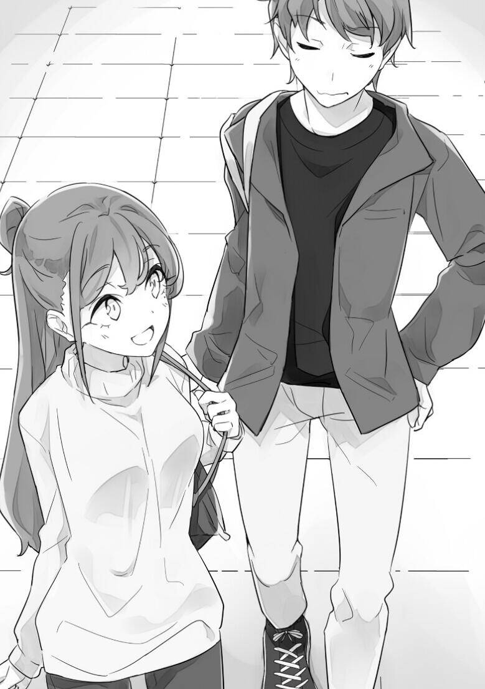
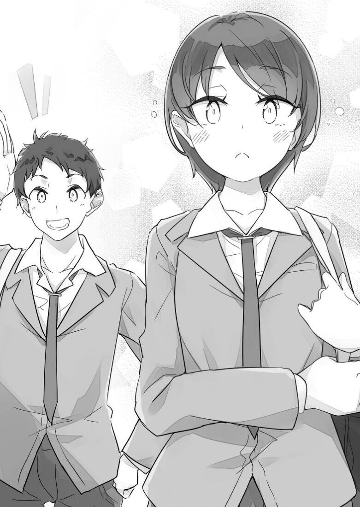
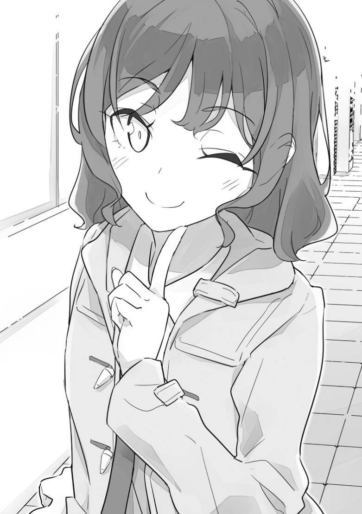

# 第三章 I need you

### 1

「哦，所以咲太就打算手把手腰把腰地教她谈恋爱哦」

麻衣用叉子刺穿了沙拉。新鲜的蔬菜发出了爽脆的声音。

「我只是复述而已，我也没和她约好，我也没要手把手腰把腰」

新的一周的星期一，12月12日。

学校食堂已经过了吃饭高峰期，各处开始出现空位，变得闲散起来。咲太和麻衣面对面坐着的那张桌子的两侧也都是空位。所以他们能放开了聊。

「咲太你不是在思考她的青春期综合征是什么么？还说是为了我」

麻衣没什么兴致地吃着沙拉。

「是啊。因为你危险了」

「我看不到这两者的关联」

麻衣把叉子从嘴里抽出来，那银色的尖端似乎在瞄准咲太。这难道是错觉吗？不，不管再怎么乐观地来看，这也不是错觉。

「呜哇，你好危险」

理央的忠告就要应验了。这下不快点想想办法就危险了。

但是，没有什么能很好稳住麻衣的说法。

就在这时，一个能救咲太于危难之中的福音响起。

「我能坐这吗？」

美织来到这边。

「随便坐」

「咦？真的可以吗？」

明明是她问的，她却显得如此惊讶。

「如果是平常的话，你肯定会说『你妨碍我谈恋爱了请你远离』之类的话」

「因为今天我心情好」

咲太随口撒了个谎用视线催促她快坐下。

「那就恭敬不如从命」

美织一边来回看着咲太和麻衣，一边坐到咲太旁边。

「……」

「呃，因为我想好好端详麻衣同学的美颜」

察觉到咲太疑问的视线的美织解释道。

「你们刚刚好像聊得挺欢，是在说什么呢？」

她一边吃着大份的炸排咖喱饭一边发问。她看到了麻衣手上那发着凶光的叉子。也只有美织这样的人能将刚才那种凶险的气氛说成是『聊得挺欢』了。

「嗯，在聊关于『如何喜欢上一个人』」

「嚯，这么哲学的问题」

美织来了兴趣。

「是吗？不是很感性的问题吗？」

咲太持完全相反的意见。

「但是你们为啥突然说这个？」

「据说是咲太他补习班里某个可爱的小妹妹问了他这个问题」

「小妹妹？」

有必要确认性别？

「是女高中生」

「咿」

美织夸张地对咲太作出嫌弃的表情。那是看到变态补习老师的眼神。不过她马上就恢复正常——

「啊，不过，我确实也有点感触。我有时也会想到底什么才是『喜欢』」 美织一边用勺子捞起整块炸排放进嘴里，把裹在炸排外侧的炸皮咬得咔嚓咔嚓响。连咲太也能听到。

「你喜欢吃炸排咖喱饭吗？」

「喜欢呀」

说着，她又吃了一块。

「那这不就是『喜欢』么？」

咲太证毕后，美织不满地嘟起嘴。她虽然眼神想刀人，但是嘴上还是不忘嚼炸排。

嚼了好几下以后她咕噜地吞下去，然后送了一杯水。等了好半天后她张口第一句话是——

「麻衣同学你到底喜欢梓川君哪里呢？」

「哦，你这个问题问得好呀！」

咲太一脸期待地看向麻衣。

恐怕美织是想用麻衣来回敬刚才咲太的话。她肯定是想要麻衣教训咲太一通。然而她这个想法错了。不管麻衣是认真回答了她的问题还是选择臭骂咲太一通，这对咲太来说都是赏赐。

在两人的注视下——

「我喜欢他『超喜欢我』这一点」

「……」

美织吃着咖喱的手停了下来。她或许是没想到麻衣会这样回答吧。勺子停在半空中。

「确实，真理」

美织把勺子放回咖喱里，发出了感叹般的声音。

她似乎是被麻衣的话震撼到了忘记了本来的目的，一直在小声重复着『原来如此，对哦』之类的话。

「美东你怎么就不来问我喜欢麻衣小姐哪点呢？」

「这不用问也知道啊」

这时，麻衣放在桌上的手机响了，她马上接电话——

「是，没问题。好的，我现在就去」

她挂断后把手机放到包里。

「凉子小姐来接我了，我要走了」

「麻衣同学你接下来是有工作吗？」

美织问了这个问题。咲太是事先就知道了。好像是什么以透明感为卖点的化妆水的广告。和麻衣的风格很搭。

「对。那我走咯，回见」

麻衣笑着对美织说完后站起来。

「餐具我来还吧」

「多谢。那拜托你了」

挎起包包的麻衣用戴着戒指的右手在腰边的位置甩了甩，作出『拜拜』的手势并走出学校食堂。

送走麻衣后，咲太又接了一杯茶，在已经没多少学生的食堂里又消磨了一段时间。在这段时间里，他也多和美织聊了一下刚才成为话题的他的学生——纱良。当然，并没有说到青春期综合征的事。

在大致说明了一下情况后，咲太他们离开了食堂去赶一点钟开始的大学课程。他们走向了距离食堂大概有一百米距离的教学楼。

「她可真厉害」

「嗯？」

「你的学生」

「你是说她拿捏男生的本领？」

「倒不如说，她是在享受来自于其他女生的嫉妒？」

「你不享受吗？」

在咲太看来，美织肯定也很受欢迎。只要和她在一起，就能感受到男学生们的视线。这种感觉自然也会影响到周围的女生。而这很自然地会引发那些女生的嫉妒。

在与美织相遇的那个研讨课的恳亲会上，她朋友看上的男学生却对她有意思，一直想要和她交换联系方式。为了逃避这种尴尬，她甚至逃到了咲太这桌来。

就因为这件事，她的朋友与她的关系也在一段时间内变得有些微妙。说不定现在关系依旧微妙。

「我可享受不来，那种明明很不爽我却又觉得竞争不过我而擅自认输的人。因为在我身边能得到一些好处所以不愿离开我的人只会让我觉得『这人好烦』」

语气非常平淡，但是说的话很是尖锐。她的厉害之处在于能把这些话说得没那么尖酸。会让人自然而然地认同，这确实是很有她风格的想法。

「不过，要说优越感那肯定还是有的吧」

「原来如此，优越感」

咲太认为优越感倒也不一定就是负面的。优越感和自信是息息相关的。

「或许姬路同学是这种优越感胜过了其他的感情吧」

「说明她就如此喜欢自己呗。比起别人更喜欢她自己」

「……」

美织只是随口说说。就是这种平淡的语气。但是她的话犹如醍醐灌顶，让咲太一瞬间醒悟了。

刚才那句话，似乎非常确切地描述出了纱良的内心。

之前朋绘也说过——她不是很喜欢想必是从中学就一直很受欢迎的纱良。因为纱良和以高中入学为契机而努力变美的朋绘不一样。朋绘是怀着自卑感说出这句话的。就好像她认为自己是假货，而纱良那种是真家伙一样。

纱良那种开朗而活跃的性格并不造作。

她的那种亲和力背后也没有任何心机。

她调戏健人时也没带有恶意。至少没让人感受到恶意。反正咲太自己是没感觉到恶意。

纱良也已经习惯了得到别人的好意。

所以她表现的比谁都要自然。

这种言行举止已经成为她这个人的一部分。

没有任何强撑的感觉。

没有任何装样子的感觉。

或许，这就是从小到大都当中央空调的人才能练就的举止吧。

根据虎之介的说法，纱良从幼儿园到小学到初中就一直是受大家瞩目的存在。这对她来说就是日常。鹤立鸡群对她来说就是理所当然的，以至于她对这一点甚至没有任何疑问。

但是，这个作为中心人物被班上的所有人宠爱，比班上所有人都过得充实的她在不知不觉中遇到了巨大的挫折。

对她来说，别人理所当然地会对她有好感。

她只需要接受别人给她的好意就行。

被嫉妒也不奇怪，这甚至是一种能激发她自尊与自信的刺激。

对在这种环境中长大的她来说，比起自己去喜欢上别的什么人，她更喜欢被别人喜欢的自己。

美织一句话就戳中了要害。

「不愧是受欢迎的美东，说出来的话就是不一样」

「我就是我，不一样的烟火」

美织得意地挺胸。

「那我顺便再问你一下，你觉得应该怎么办好？」

「你是说你的那个可爱的女学生？」

她还特意强调了『可爱』。

「没错，就是那个可爱的她」

咲太并不缩。纱良事实上就是很可爱。他只是在陈述事实。

「那就照她说的那样，让她变成像你一样能喜欢上别人的人不就好了？」

「那要怎么做？」

「让她喜欢上你？」

说完，美织实在忍不住了似的笑喷出来。

「倒是个好办法」

咲太没好气的回答。这应该也是美织希望看到的他的反应。

「这我就暂且不跟麻衣同学告密吧」

——证据就是，她显得更加开心了。

<figure><figcaption></figcaption></figure>

「那我真的要谢」]

「说真的，你要小心点哦」

美织看过来。

「小心什么？」

「那当然是别步了别人的后尘——千万别成为第三个变态补习班老师？」

说到一半，她开始独自笑个不停。

「我心里只有麻衣同学」

「真的？但是今天到现在为止你满口都是那个可爱的女学生诶」

「……」

非常犀利。

「这难道不是正中她的下怀吗，梓川老师？」

真的非常犀利。

不知不觉中，咲太可能已经开始步人后尘了。如果现在不悬崖勒马，结果可能会更加严重。一想到这里就觉得这事情不是闹着玩的。

「我会小心的」

在得到美织堪称完美的建议之后，咲太来到了教学楼。中午一点的课就要开始了。

### 2

两天后的星期三。12月14日。在大学上课到下午四点后，咲太拒绝了拓海联谊的邀约，直接回到了藤泽站。

他并没有走向自己所住的公寓，而是走向了位于相反方向的补习班。

到补习班的时候已经五点半了。放好东西换好衣服之后，咲太赶快来到职员办公室准备今天的授课内容。

为健人和树里准备复习之前知识点的试题。

为纱良找了几道大学招考级别的问题。首先是统考难度的问题，然后再从名校的往届试题中选——这时，他感觉到了视线。

一抬头，发现树里从公共区域与教员区域的分界线——柜台的另一侧看着他。

「那个，梓川老师」

在对上视线以后她也喊了咲太的名字。刚才似乎是咲太专注于工作，她不好打扰。

「吉和同学。怎么了吗？」

树里很少主动搭话。他站起来走到柜台前。

「原定这周六的补习，能换个时间吗？」

「可以呀」

是有什么安排吗？

「有沙滩排球的比赛。我忘记告诉你了。抱歉」

「这种季节也比？」

说起沙滩排球自然就要想到盛夏的太阳，白色的沙滩，小麦色的肌肤和五颜六色的泳装。

「本来是要9月份比的，因为台风推迟了」

「现在都12月了」

「要去冲绳比」

「那边这么暖的吗」

说起来，从前段时间翔子之前送来的照片来看，她那边完全还穿着夏装。

「也不至于。毕竟都冬天了，大多数选手都会穿上衣吧」

「沙排还有上衣穿？」

真是接连不断地学到新知识。咲太还以为它完全是夏天才会有的运动。

「总之我懂了。比赛要加油哦」

「是，多谢」

「那什么时候补习呢？」

看向贴在墙上的日历。

「12月23日老师有什么安排吗？」

「可以啊。那就23日」

「好的」

在说完该说的话以后，双方沉默了。

「……」

树里无言地盯着日历，并不想要离开。

「还有什么？」

咲太的问题让她敏感地抽了抽肩膀。

「……呃，那个，我有一个好朋友——」

声音小到听不见的她眼神还在日历那边游离。她根本没心思去看日历，她的意识完全集中在别的地方。

「哦，你说的这个朋友是不是——」

「我，梦到了那个人被甩了的梦。那个人跟他喜欢的人告白……」

「毕竟最近『#做梦』很火嘛」

「是，那个……你说，这种时候我该怎么办呢？」

「你是在说山田同学和姬路同学？」

「！？」

不肯定也不否定。她露出了纯粹的震惊的表情。因为太过惊讶，她甚至说不出话来。但她表情仿佛在问『你为什么知道！？』

「毕竟山田同学也太好懂了」

「……」

这次，树里还是没有肯定或否定。她露出了有些困扰但又有些生气的表情。又或者她只是在拼命让自己冷静下来。

「但是这对你来说不是好事吗？」

「……怎么可能是好事。自己喜欢的人被那种讨厌的女人玩弄于股掌之间」

树里的眼神里透着的感情比她声音的更强烈。那是一种不甘心，是一种愤怒。

「你这么生气，那你就把山田同学迷倒啊」

「我不行」

树里确凿地说。她完完全全地否定了任何的可能性。

「我根本不可能赢过姬路同学……」

她的声音小得根本就听不见，视线也看向下方——不，更下方，是看着脚边的地面。

纱良是很受男生欢迎。

但是树里也不至于毫无胜算。至少咲太认为树里没必要悲观到这种地步。

「那我希望你不要生气听我说完」

「……说什么？」

树里稍微抬视线，她话语中已经有一些不满。她应该不是对咲太发火，而是因为他们在说令她讨厌的话题，这让她心情不好。

而与咲太对上视线的她眼中透着意思期待，她双手紧紧攥着柜台的边缘，满怀紧张地等着咲太接下来的话。

「我觉得你露个什么泳装的晒痕给山田同学看，他就缴械了」

「……」

说完后暂时没有反应。

她可能是还没理解咲太在说什么。她表情毫无改变，只是猛眨了好几下眼睛。

最后似乎是理解了意思的她撇开视线。

「……真的吗？」

咲太本已做好觉悟被臭骂一顿，但是树里说出的却是这样柔声细气的，类似确认的话。她抬着眼看向咲太，眼中开始出现希望的光芒。

这波或许是给错意见了。

「我是真心这么想的」

但是说都说了，又不可能回头。咲太也没觉得自己说了谎。那么要做的事只有一件——一路走到黑！

「……」

树里若有所思地沉默了。咲太很想问清楚她这时到底在想什么，但是时间并不允许——

「大家好——」

一个虽然声音不小但是没有任何干劲的声音传了过来。正是健人。

「啊，咲太老师好」

树里完全没看健人。一直拿背对着他。所以健人根本看不到现在树里通红的脸。

<figure><figcaption></figcaption></figure>

「既然人都来齐了。那我们可以开始上课了」

「嗯？姬路同学已经到教室了吗？」

还什么都不知道的健人随口说出这个名字。这时候树里双手紧握住了自己的包。这也是没办法。

「我对姬路同学有不同的课程安排，所以把时间错开了」

「哦？哦」

健人装作满不在乎的样子把手插到裤口袋里。

「你们先去教室等着吧，我马上就到」

「咲太老师，今天要干什么呢？」

「首先是复习之前的内容」

「我已经不想再看到sin和cos了」

「还有tan呢」

「你杀了我吧」

健人一边抱怨着一边走进教室。树里则一直在他背后愤愤地盯着他。

从下午6点钟开始的为时80分钟的课程在晚上7点40分时准时结束。

「山田同学辛苦了。今天就到这里吧」

「总算是结束了。补习班这课也太长了吧」

和高中的一堂课相比确实长了。从感觉上来讲是长了一倍吧。

「去了大学你还要享受90分钟一节的课呢」

「那我绝对不上大学了。我决定了，我必不去」

健人无力地扑倒在桌上。

「啊，对了，山田同学」

「怎么？」

健人唯独把头抬了起来

「星期六的课，能换到12月23日么」

「哦？真的？我能休周六了？」

「只是换到别的日子上而已」

又不是说少上一节课。但是这周能休对于健人来说似乎是大喜事。

「原因是什么呢？」

「吉和同学要去冲绳参加比赛」

「哦，是全国性质的比赛吗？」

健人突然对正在收拾笔的树里搭话。

「是。怎么了？」

「好厉害啊。你才高一啊」

「很正常啊」

「不不不，一点都不正常啊。总之你加油吧」

「……」

突然被加油了的树里僵住了。随后——

「嗯，我会加油的」

她出人意料地好好回应了。说出口后又觉得自己不该怎么回答，于是她慌乱地四处望着。眼睛珠子都要转得掉出来了。好在趴在桌上的健人根本没看她。即便如此，她还是在说了一句『我先走了』之后逃出教室。连大衣也没穿，连同书包一起拿在手上逃走了。

教室里只剩下咲太和健人。健人一直趴在桌上，完全没有要离开的迹象。 「你怎么还不走？」

一般来说他都是第一个走的，让人觉得他不想在这个破补习班多呆哪怕一秒。然而今天却不一样。

「那个，老师」

「怎么？」

「姬路同学，有在交往的对象吗？」

「你是她的同班同学，你不应该比我清楚吗？」

「好像是没有吧……」

「那么？」

「那他有没有喜欢的人呢？」

「你问我不如直接问她」

「就因为不好问出口所以才来问咲太老师的啊！老师你能帮我问问吗？」

「我拒绝」

「求你了!」

健人继续以趴着的姿态对咲太双手合十。

这时，有个人影进了教室。

「啊，你们还在上课吗？」

那正是他们聊到的纱良。

她来回看着正在拜求咲太的健人以及正在被拜的咲太。

「看上去不像是在上课？」

她露出笑容问道。

「山田同学说他有事情想问你」

「喂！咲太老师！」

健人慌忙支起身。因为太猛，他直接立正了。

「山田同学，有什么事吗？」

「不，不是什么大事」

「那你就问啊。这样搞得我也会很在意的」

健人一瞬间就被动了。

「呃，那个……马上就是圣诞节了」

「嗯」

健人居然从这个点开始切入。他真的有想好自己该怎么表达么？恐怕是没有吧。

「最近学校里开始交往的男女也多了起来」

「那这确实是让人有些着急呢」

「我刚刚就是在和咲太老师聊姬路同学你有没有正在交往的对象」

强行把话题引到了正题上。并且还在这个点上搬出了咲太。恐怕他是承受不住在对话时纱良看着他的视线了吧。

虽然被卷入其中的咲太感到很莫名，但总体来说健人这波算是努力了。 但是健人犯了一个巨大的错误。如果以这种方式问的话，纱良一定会有一个很犀利的反击。

「那为什么山田同学会去在意这种事呢？」

「啊？为什么？」

健人已经放弃和纱良面对面了。他怂怂地对咲太使着『快救救我』的眼色。

咲太无奈，决定出手帮一回。

「毕竟如果姬路同学有恋人的话，圣诞节这两天我就没办法安排上课了」

「难道不想在圣诞节这两天上课的，不是咲太老师你自己吗？」

正如他所设想的那样，纱良开始把话头转向咲太。

「没错。我绝对不想」

「老师，我们和恋人到底谁更重要啊」

「那当然是恋人啊」

「即便心里这样想也不要这么说嘛。还板着脸这么说」

咲太认真回答以后，纱良装出生气的样子笑着『训斥』咲太。

「是啊，老师」

健人为了远离刚才那个话题，也开始加入了攻击咲太的行列。他以极其自然地动作穿着大衣做好回家的准备。真希望他之后能知恩图报。

「那我先走了」

健人跟咲太与纱良这么说完，开始往教室外走。

「啊，山田同学」

纱良叫住了健人。

「呃，怎么？」

被明确叫了名字的他也不好不回头。他的表情还很僵硬。

「我虽然没有在交往的对象，但是我有比较在意的人」

「……」

健人保持扭头看向这边的状态张着嘴愣住了。他想要说什么，但又闭上嘴，最后只发出了一点奇怪的呻吟声。并不是人类能听懂的语言。

「就这些。再见」

被纱良挥手告别的健人也下意识地举起一只手，说出『啊。好』这种意思含糊的话。最后，他晃晃悠悠地走出了教室。

教室里只剩下咲太和纱良两个人。

纱良若无其事地坐在座位上，把笔盒以及笔记本拿出来，然后抬起头回应咲太的视线。

「我觉得刚才是咲太老师不好，谁让你说那种话题」

「我并没有想说你什么的意思」

「但你的眼神像是在说『她又搞这种事』」

「不，我只是在感慨你很厉害」

「是说『在某种意义上』很厉害吧？」

「是在各种意义上都很厉害」

「那今天上课咲太老师就来教教我这种情况下我应该怎么办吧」

「那么请你先解开这道题」

咲太把两页题目放到桌伤。

「第一张是统考级别的问题。第二张是名校的自主招生的题。都是与二次函数有关的问题」

「解开这些问题，我就能像咲太老师这样变得能喜欢上别人吗？」

「解开这些问题，我就能明白你现在学力有多高。时限是40分钟」

咲太把计时器拿给纱良看，然后按下开始键。

好像还有话想说的纱良在一听到哔的开始声后马上开始解题。这一点确实有一种认真的优等生的感觉。只是她还噘着嘴，显露着对咲太的不满。

在等待的这一段时间，咲太也开始做题。如果连自己都做不出来的话就没办法讲解了。

首先是统考级别的问题。这道题三个小问都能顺利解出来。

然后是名校的往届试题。这就没有这么简单了。在选问题的时候他看过参考答案，以为自己已经完全理解了。但是真要自己解的时候又觉得自己懂个锤子。

如果解不出来就闹笑话了，所以咲太伸手去拿参考书。在与参考答案大眼瞪小眼的功夫，时间在不断的流逝。最后在解完之前40分钟的铃就先响了。

纱良『呼』地吐了一口气，扔掉了笔。就像是考试结束了一样把双手放在膝盖上，表情凝重。

「如何？」

「只解出了一开始的两个问题」

这次的问题一共有五道。统考级别的有三道，名校试题有两道。

「现在就能解出两道题算是足够优秀了」

纱良还是高一学生，离真正高考还有两年。

咲太看向纱良在笔记本上写的解答，她所说的『解出了』的那两道题确实是正确答案。

第三道题就算是陷阱题。纱良被出题者骗到了，往错的方向进行解答。她似乎在解题的过程中发现自己弄错了，但也没有时间去解出正确答案了。 「那首先就从第三问说起吧」

咲太在白板上写出标准答案。

在写出第一个式子的那一刻——

「啊，原来是用这个式子啊」

纱良发出了惊呼。

她马上就发现自己是在哪里弄错了。

「没错。和这边这个函数一点关系都没有」

只要一开始没有上当，用很简单的计算就能解决问题。与其说是在考数学不如说是在考语文。

这个陷阱题巧妙的地方在于，有好几道和它相像的题是需要用纱良笔记本上写着的那种解法去解的。也就是所谓的『常规问题』。所以越是积累了那种题目的解题经验就越容易栽在这题上。

「这问题出得就像是咲太老师一样」

「那我还是比这道题善良点的吧」

「我就喜欢咲太老师这种厚脸皮的调调」

「那下一题」

「请不要无视学生的告白」

「我也并不讨厌你这一点哦」

「……」

咲太的话使纱良惊讶地瞪大了眼睛。

咲太并没多管她，而是转过背去在黑板上画出二次函数的图。

「如果你对别人也是这种态度的话我倒是会有点担心」

「……什么意思？」

「没错。有这种想法就对了。这个看似简简单单的y=x，实际上非常棘手」

「我想问的不是数学题，而是老师刚刚说的话的意思」

咲太停下手，回头看向纱良。

「……」

纱良也看着咲太。

接下来该怎么说呢。

纱良看着在纠结怎么说才好的咲太，嘴角不禁浮现出笑容。

这时，有个熟悉的人影走过教室——是理央。

「啊，双叶，等等」

被咲太叫住的理央又回到教室门口。

「怎？」

「你来一下」

咲太招手让她过来。她一脸疑问地走进了教室。

「你们不是还在上课吗？」

她看了一眼纱良。

「这道题我有点不懂，拜托你来解说一下」

「作为一个补习班老师，你不觉得这话很不对头吗？」

「求你了」

理央看向咲太递过去的题，思考了大概三十秒以后，反手就把咲太在白板上画的图给擦掉了。

她从头开始画函数写式子，途中也很明确地解释了每个图每个式子的意思。她没有省略或者跳步，而是很仔细地写清楚了每一步。

咲太二十分钟都没搞懂的难题，理央五分钟就搞定了。

解完了之后，白板上已经满是图和算式。

「这样大概明白了吗？」

给马克笔盖上盖子后她回头看过来。

「我懂了」

咲太比纱良更先回答了。

在她解题的过程中，咲太也坐在了纱良的身边一起听课。

「我没问你」

理央没好气地回答。

纱良缓缓点了点头发出了赞叹。

「我已经彻底弄懂了。解释得非常清晰易懂」

「姬路同学，你除了数学以外其他的成绩应该也不差吧？」

理央和纱良都看向突然提出这个问题的咲太。那是带着些惊讶又带着些疑惑的眼神。

「也不算，差……？」

纱良作出了一个显得谦虚的回答。

「第一学期的成绩平均起来是怎样？」

「在『8』或者『9』之间吧」

这成绩比咲太预想的还要好。肯定基本上是『8』或者『9』，有少数是『10』或者『7』吧。这种成绩咲太自己连想都不敢想。但高中时代的麻衣的成绩表大概也就是这种水平。

「我觉得你的话，趁现在找个好老师带你的话，想要一次考上名校也不难吧？」

察觉到咲太这话的意图的理央有些厌烦地看过来。

「你想说什么？」

「比起我，双叶更会教人。姬路同学你也这样想吧？」

越是难的问题，差距就越明显。

「所以，你让双叶教你可能会更——」

——好。

在咲太说出这个字眼之前。

「我就想要咲太老师教我」

——纱良以透着急迫感情的话语打断了咲太。

「……」

声音倒不是很大，但是其中透着非常坚决的态度。教室里的气氛瞬间就冻结成冰，还是那种一碰就碎的脆弱的冰。开始有一股不妙的感觉。

理央露出了有些惊讶的表情。咲太内心里也很惊讶。因为他还是第一次见到纱良如此表现出自己的真心……

不过最感到惊讶的肯定还是纱良自己吧。

她惊讶于自己会冲动地说出这种话。

她惊讶于自己感情居然会喷发。

惊讶于自己似乎发出了比她预想的还要大的声音。

「发生什么事了？没事吧？」

补习班的校长从门口背后探出头来。他正在巡视教室。

校长先看到了纱良的背影，然后又有些困扰地看向咲太。他的表情中透着些许紧张。因为他知道咲太已经是第三个负责带纱良的老师了。他也很清楚前两个老师都发生了什么事。

「对不起。有一道题我弄的不是很清楚，于是请双叶老师来帮忙解答了」

「是吗？」

纱良也点头回答『是的』。然后理央也简短了说了一句『是』来回应校长。

沉默。

最先打破沉默的是宣告一节课结束的计时器的铃声。那铃声也不是很大，但也足够让纱良有所动作。

「今天多谢指教」

纱良低着头把笔记本和笔盒放进书包然后拿起大衣——

「下回也拜托了」

她低头敬礼后离开了教室。

校长似乎想对她搭话，最后还是忍住没叫住她。然后校长转向咲太。

「这没问题吧……」

他问出了一句极其含糊的话。也不知道他到底想问什么没问题。但校长稳得那么含糊就是因为情况难以启齿。

所以咲太也很含糊地回答了一句『没事的』。虽然没有任何实质意义，但至少能在形式上让这件事告一段落。

「总之拜托你咯」

说完，校长离开了——最后连脚步声也听不到了。

这次留在教室里的变成咲太和理央了。

理央深吸了一口气说。

「你到底想怎么样？」

她这口吻甚至能说是在严厉地责问咲太。

「什么怎么样？」

「你是故意惹她生气的吧？」

虽然她是在对咲太发问，但是内心已经笃定了答案。

因为被咲太卷进去了，所以想要咲太好好给个说法。

「从结果上来讲，我这么做是为了守护麻衣小姐」

咲太所做的一切都是为了这个。

「你是指那个信息？快去找雾岛透子和樱岛学姐有危险那个？」

咲太点了点头。

「你之前也说过只有两种可能吧。要么是雾岛透子直接加害麻衣小姐，要么就是雾岛透子引发的青春期综合征的患者让麻衣小姐遇到危险。但是前者的可能性比较低」

「是啊」

与透子见面后咲太得出的结论也正如理央所说的那样。

「那么把范围缩到后者的话……原来如此，梓川你已经明白她的青春期综合征是什么了吗？」

「这我还完全不明白」

「……那我也完全不明白你到底想说什么」

理央也少见地皱起眉头。

「我还不知道她的青春期综合征是什么现象。但是我大概清楚她为什么患上青春期综合征了」

说到这个份上，理央一定能理解。

「……哦，原来如此。确实这很有你的风格。总之你就是想在不知道她的综合征的症状的情况下直接治好她的心病嘛」

「这主意不错吧？」

至今为止遇到的青春期综合征全都与心中的症结有明确的联系。问题的根本就在那里。所以，如果只是想着『治好』的话，纱良的青春期综合征会引发怎样的超自然现象都是次要的。只要直接解决纱良的心理问题就行。条条大路通罗马，得到正确答案的解法并不是唯一的。

「那你也没必要这么欺负一个才上高一的女生吧。你还是个成年人吗」

「嗯，或许是会被讨厌吧」

「但这不就是你的目的吗？不过她……虽说是达到了你预想的目的，但她那个反应未免有些太激烈了？」

「啊，这还是多亏了你」

「我？」

「我之前有跟你说过姬路同学患上青春期综合征的契机吧」

「被甩了的那事？」

「对，她其实就是被加西同学甩的」

「……」

理央无语了。

「梓川」

能从理央平静的话语中感受到她的愤怒。

「嗯？」

「以后你把我卷进去之前能不能先跟我说一声」

「我说了你就愿意帮我吗？」

「像这次这种情况的话我是绝对不会帮的」

所以咲太才没说。而且这次确实也没什么机会说。

### 3

第二天，星期四。咲太醒来的时候天上在下雨。

持续了小一段时间的晴朗而干燥的冬季终于迎来了雨水。气温和昨天一样，但是莫名更加温暖。或许是因为湿度上来了吧。

不过，这段雨结束的那个周末开始气温又会骤降。穿着冬装的天气栏目的主持人姐姐说『接下来将会迎来真正的寒冷』。

「梦境中的那个圣诞确实是很冷」

咲太一边想着这种事一边拿着伞走出家门。

除了下雨以外，一路上没发现什么特别的情况。藤泽站早上的状态，东海道线的拥挤程度，换乘的横滨站的热闹程度……这些都和往常一样。

和昨天，前天，一周前相比都没什么变化，都是自己熟悉的景象，自己熟悉的人烟。

唯一的变化就是从横滨站换乘京急线之后，那个有独特加速声音的列车已经看不到了。因为挺稀有的，所以坐上了还有种中奖了的感觉。但是现在连最后剩下的单编组车厢都退役了，今后上学又少了个乐子。

整个社会，整个世界像是没有变化，但却又在一点点的改变。

大学后半学期的课程也将收关，每堂课都在说交结业论文的事或是宣告明年一月份会有期末考试。

今天第一堂课，第一外语（英语）最后是要考笔试和听力。第二堂课，大类课程的研讨课是要交期末报告。第三堂课是为了学习统计学而打基础的数学课，考核方式自然是笔试。第四堂课是电脑课，期末的课题是自己制作一个网站主页。

电脑课结束后，『这作业要怎么办？』『什么时候搞啊？』『不是明年才交吗，小菜一碟！』之类的对话随处可以听到。并没有什么人打算现在就给他肝出来。大家在一种轻松愉快的氛围中快步溜出了教室。

走廊上又有『肚子饿了，先去吃一顿吧？』『我没钱吃饭了』这样很快就换了话题的小团体的声音传来。

与此同时，咲太还在面对电脑，把『樱岛麻衣』和『#做梦』放到一起搜索。

如果有人能梦到麻衣发生什么不幸的话，那个信息也自然就有了线索。 正因为麻衣是有名人才能用这招。

但是和之前那几次的结果一样，今天他也没看到有人在SNS上留下什么有价值的信息。

然后咲太又加入了『雾岛透子』进行检索。

因为如果有什么关于透子的新情报的话，他就能明白为什么非要『找到雾岛透子』不可……

但是，依旧没有找到什么新的线索。

找到的只有推测『樱岛麻衣』就是『雾岛透子』的无端猜测。

——歌声很像。

——在日剧中哼歌的声音很接近。

——据说很快就要官宣了。

网民真是胡说八道。

麻衣怎么可能是透子。

咲太很明确她们是两个不同的人。

但是令他感到惊讶的是居然还真有一批人信这种论调。

如果不像咲太这样，真正见过她们两个的话，或许信也不奇怪吧。如果本身对这件事就没什么兴趣的话，听到谣传也只会说『哦，是这样啊？』然后把它当作真的去接受。因为不管它是真的还是假的，对没兴趣的人来说都无关紧要。

世上这么多离谱的谣言与传闻就是这样蔓延开的吧。

「梓川，你在查什么呢？」

一语不发地留在他身边的拓海突然对他搭话。

「查一些麻烦事」

因为很难全都说明清楚，所以就随口概括了。

「那想必是很麻烦吧」

拓海只是笑笑，也没有打破砂锅问到底。

「那你看啥啊？」

拓海一直在认真盯着电脑屏幕，已经有一段时间了。

「学园祭时，不是有男女学生的选美大赛吗」

「好像是吧」

那是上个月初的事了，从那之后已经过了一个月。

咲太并没有亲自去看选美，只知道和花她们甜蜜子弹的成员作为嘉宾出戏了，然后还给获奖的男女生颁发了奖杯。

「这个网站就是在介绍历代的优胜者」

「原来你是在看哪一届的横大小姐最漂亮啊」

确实是男生倾向去干的事。如果是几个人一起看的话，还会有『她是我的菜』『我绝对选她』这种热烈的讨论。

「我本是想这样的。但是发现了个奇怪的事。唯独去年的Miss.横大我没看到没有介绍。Mr.横大我倒是看到了」

「该不会是这页有Miss吧」

「毕竟她是Miss.」

「……」

「……」

「不对，是梓川你起的这个头啊」

「……」

「你能不要无视我吗？」

咲太继续无视了拓海，重新开始寻找关于雾岛透子的信息。这时，他放着手的桌子开始轻微震动。是拓海放在桌上的手机一边震动一边滑了起来。 看了一眼手机画面，那是咲太知道的名字。

之前一起去联谊的国际商学部的大二学生，小谷良平。

「你好，什么事」

拓海爽朗地接了电话。

「今天的联谊有个人来不了了，福山君你来吗？」

或许是因为音量调太大了吧，连咲太都能听到对面在讲什么。

「我去我去我当然去！」

他不假思索地回答。

「哦？那等下发你详细信息」

「好，非常感谢感激涕零」

拓海麻溜地结束了通话。他迅速站起来穿上大衣背上书包。

「那我就先走了」

拓海一边对咲太挥手告别一边打算离开教室。

「你电脑还没关呢」

「你帮我关吧！」

——走廊外传来了拓海的声音。

咲太一边在心中祈祷着连和谁联谊都不知道就直接要去的拓海能够安然无恙，一边伸手操纵鼠标准备关掉拓海的电脑。

但是，他的手猛地停住了。

他直勾勾地盯着画面。

那是去年选美大赛的优胜者。

拓海说那是唯一一个没有简介的优胜者，但并非若此。

只是拓海看不见而已……

只是拓海无法认知到这个简介而已——

她有一头黑色的长发，穿着清纯的白衬衫。

对相机露出有些含羞的笑容的她——

正是在大学里偶尔能见到的迷你裙圣诞老人。

雾岛透子。

他看向简介。

简介最上方出现了一个陌生的名字。

「岩见泽宁宁……？」

也就是说雾岛透子只是个笔名。

去年她就是大二学生，那也就是说现在她已经大三了。如果是应届考上大学的话，她比咲太还大两岁

所属专业是国际通识学部，和麻衣以及和花一个专业。

出身北海道，生日3月30日，身高161cm。

简介上的信息到此为止了。

这个意外的收获让他兴奋起来。这种极其罕见的巧合让他心跳加快。但冷静想想，他现在不过也就是知道了她的本名，所属专业，学年，出身地，生日以及身高而已。

这些都是表面上的情报。完全无法透过这些看到她的本质。

即便如此那些依旧是通向其本质的线索。

咲太怀着期待，在键盘上打出『岩见泽宁宁』这个关键字，按下了搜索键——

### 4

在搜索『岩见泽宁宁』大概一个多小时之后，咲太终于关了电脑。现在时间已经过六点了。

他沿着之能听到自己脚步声的走廊走出教学楼。本来就因为下雨而显得阴沉的天空现在是一片黑。被街灯照亮的林荫道已经被夜晚的气氛所笼罩。

不过还是能看到一些在林荫道上走着的学生，也有与打算回家的咲太擦肩而过的，穿着白大褂的学生。恐怕是正在搞毕设的大四学生吧。他们手上提着便利店的袋子，里面装有杯面和塑料瓶装的咖啡。

咲太今后是不是也会经历这个时期呢。

他一边想着这个，一边走向车站，顺利坐上了一趟快车。

在京急线上摇了20分钟左右，咲太和其他大量的乘客一样，在横滨站下了车，换成东海道线。

东海道线上又是20分钟。

咲太来到藤泽站的时候已经过了晚上7点，很多上班族穿行于此。

他抱怨着依旧下个不停的冬雨，一边撑着伞走上回家路。

他在路上一直思考着。

今天得到了几个新的信息。

首先。搜索『岩见泽宁宁』后最先看到的是她本人的SNS账号。那是可以发布照片和简短文字的SNS。

仔细看了一下，发现她在拿大学的选美冠军之前……从高二开始就在北海道本地进行一些模特活动。

在考上大学以后，她搬来了神奈川县。

成为大学生，在选美大赛拿到优胜后，她顺利签约了模特事务所，做以时尚杂志为主的平面模特。

SNS上的她，有些自豪地说着自己的模特工作一帆风顺，接到的活儿也渐渐多起来。然而这样顺利也只持续到了今年春天。在4月6号之后，她的账号完全不更新了。

「就是从这时开始她无法被人观测到」

据咲太所知，迷你裙圣诞老人是只有咲太才能看到的，别的任何人都看不到。这样她就没办法当模特了。

但是她SNS上并没有说任何关于『雾岛透子』的事，也没有说任何关于音乐的事。

难道是说她把模特方面的工作与音乐方面的工作完全分开管理了吗？

咲太又不是她本人，自然是不可能知道其中的缘由。

「这个就等下次见面的时候再问吧」

得出这个结论时，咲太正好看到公寓前停着一辆熟悉的车。

白色的面包车。

那是麻衣的经纪人，花轮凉子开的车。

走近一看，驾驶座上的人确实是花轮凉子。

凉子发现咲太以后跟咲太打了招呼。咲太也作出回应。

但是凉子马上转移了视线，她看着咲太所住的公寓的入口。咲太也看了过去——麻衣出来了。

她走到正准备打伞的麻衣面前，把自己的伞倾斜过去给她挡雨。

「咲太你回来啦。今天挺晚」

「我回来了。因为要查一些事」

「大学的作业？」

「麻烦事」

「有什么进展吗？」

「也不知道说不说得上是『进展』吧，总之有点东西」

因为还没有得出结论，所以不管怎么说都不说不清楚。

「那我晚上再跟你打电话吧，现在没时间了」

「要去工作吗？」

「工作是明天。但是今晚要过去准备。我要参加在福冈举办的电影节」

「那种要穿礼服走红毯的？」

「是。漂亮的那种」

「我也想看」

「凉子小姐会拍很多照片的」

「我想看真家伙」

为了不让往前走的麻衣淋湿，咲太陪麻衣一起朝面包车的后侧走去。自动门为了迎接麻衣而滑开。

「晚饭我已经做好了，你和花枫吃完饭先吧」

麻衣走进车里，并且马上系上了安全带。还不忘对咲太给她打伞这件事道谢。

「对了咲太」

「怎么？」

「我预约好箱根的温泉旅馆了」

「平安夜那个？」

「虽然也不知道你能不能去」

「我绝对去」

「即便你去不了，凉子小姐也会陪我住的。所以你也不用太勉强自己」 「那个旅馆我早就想住一次了」

一直在旁边默默听着的凉子小姐突然说出这句像开玩笑的话。不，说不定她是真的想住那个旅馆吧。副驾驶席上还放着箱根的旅游导览。她比谁都积极。

「那如果我真去不了了，就拜托凉子小姐替我好好玩一波咯」

「但是我又不是很想和想必心情会很糟的麻衣小姐一起玩」

「你们两个在说什么呢」

咲太和凉子小姐同时笑了。咲太一边笑着一边从车门附近撤开一步，示意凉子小姐开车。

于是滑门开始往前滑动，像是拼图的最后一小块被填上了一样严丝合缝地闭上了。

车缓缓地发动，最后消失在了夜色之中。唯一还能看见的赤红的车灯也在拐弯以后看不到了。

### 5

「真的好期待和麻衣小姐一起泡温泉呀」

在自家卧室泡澡的咲太不由得自言自语起来。

身体渐渐变得暖和了。肚子被麻衣做的肉汁白菜卷填满，心中又被对平安夜的小旅行计划的期待填满。

但是有一些事情让咲太无法百分百地高兴。

「要是平安夜能之前能把这些破事摆平那就再好不过了……」

然而这几乎是不可能的。

今天是15日。剩余时间只有一周。

在此之前是否能治好雾岛透子的青春期综合征呢。

在此之前是否能治好姬路纱良的青春期综合征呢。

至少从现在来讲，前者基本是希望渺茫。虽然今天有了些许进展，但是还没得到关于透子的关键信息。

另一方面，想要在一周之内搞定后者也是极其困难的。下一次补习课上纱良会是个什么态度也是未知数。现在还没看清事情的走向。

再说青春期综合征是患者本人的心理问题。咲太再怎么去关照，最后也只能靠患者本人去克服。咲太并不能亲手治好它。

至今为止都是这样过来的，今后恐怕这种情况也不会改变。

「到头来，还是只能顺其自然」

于是咲太很快放弃去思考这些想了也没用的事，在身体彻底暖起来之后结束了泡澡时光。

在更衣间用毛巾擦头，从上往下擦——这时客厅的电话响了。

「哥哥，有陌生的电话打过来」

没过多久，花枫这么说了。

「那你先帮我接一下吧」

听到是陌生的号码，咲太第一反应是透子打来的。如果是的话那绝对不能放跑这个机会。必须要尽可能地增加与透子对话。这是了解雾岛透子本人的好机会，也会成为治好她青春期综合征的线索。

「啊，为什么要我去接啊\~」

虽然花枫不满地抱怨了一句，但还是拿起了听筒。

咲太麻利地擦完身体穿上内裤。

「……是的，没错」

穿着一条内裤跑来客厅的咲太与正在接电话的花枫对上视线。

「哥哥，是补习班的人打来的」

说着，她递出了听筒。

「补习班的人？」

「是个男的」

咲太怀着不解拿起听筒。

「您好，现在换人接电话了」

咲太有些畏缩地接了电话。

「啊，梓川君？」

是一个熟悉的成年人的声音。

「校长？有什么事吗？」

「不好意思深夜还来打扰你呀。刚才姬路同学过来联系我了」

「是发生什么事了？」

听到纱良的名字，咲太又问了一遍同样的问题。

「不，也没什么大事。她是来问我你家的联系方式的。因为她想和你定一下下次补习的日程。毕竟你家的联系方式属于隐私，所以我来征得你的同意」

「啊，感谢校长的体量。我的完全没问题，请直接把这个号码告诉她吧」

「好的好的，那接下来就拜托你咯」

「好，在下明白了」

等对方挂断电话以后咲太才把听筒放了回去。

反正电话马上又要响一次。纱良会打电话来。

想必校长现在是在和纱良打电话告诉她咲太家的联络方式吧。

而现在纱良则会把号码记下来，然后道谢，然后挂掉电话。

纱良差不多该打电话过来了。

然而——过了五分钟，十分钟——咲太的电话依旧没有响。

难道说是校长没有成功联系上纱良吗。

「哥哥，你再这样下去要感冒了」

把电脑放在暖炉的矮桌上听着网课的花枫好心提醒了一句。确实，这种季节只穿一条内裤也太刚了。

于是咲太回到自己房间去穿衣服。

但就在这时，电话响了

「花枫，你接一下」

「啊，又来？」

客厅那边有了些响动，是花枫站起来的声音。咚，咚，咚——她大跨步地走向电话，但是铃声响到一半就停住了。

「哥哥，电话被挂掉了」

咲太穿好衣服后来到客厅。

在电话面前与花枫进行交接班。花枫又坐回了暖炉里。

正当他伸手要去按按键确认是谁打来的时候，电话又响了。是070开始的11位的手机号码。

咲太接了电话。

「这里是梓川家」

「啊，那个，我是咲太老师的学生姬路」

听到了一个紧张的女生的声音。

「姬路同学？是我啊」

「唉\~太好了，是咲太老师接电话」

「打个电话而已，有这么夸张么。而且还挂了一次」

「因为我平常也没给别人家里打过电话啊，所以，我很紧张……然后一不小心按到了挂断」

「真的？」

连手机都没有的咲太完全不能理解这种紧张感。

「咲太老师，你还是弄个手机吧」

不满的声音从对面传来。

「打电话问补习班要你的联系方式这件事本身也是很费神的」

「关于这个我是该对你道歉。我应该早就跟你说清楚的。啊，但是你问古贺的话不就能知道了吗？」

「我怎么好再麻烦人家」

对于纱良来说这可能是合乎道理的吧。但是咲太并不能理解她的想法。再问一次古贺不就好了吗。就说之前接通的时候忘记问咲太的联系方式了就行。

「总之很烧脑的」

透过电话都能想象出纱良噘着嘴的表情。

「抱歉抱歉。那么，你是想聊日程的事？」

「那不过是为了问咲太老师联系方式的借口」

「那你是想？」

咲太直切主题。电话对面的纱良深吸了一口气说。

「昨天是我失态了。对不起」

她道歉了。

「我并不觉得你失态了，所以你也不需要道歉。倒不如说我还挺高兴的」

「咦？」

「因为你坚持选择了我」

「那，那是！你快给我忘了……！」

纱良急了，她一下子喊了出来，但很快声音又变小……最终变得几乎听不到了。

「不过，如果只是为了这种小事的话，下次见面时再说也行的」 这样就不会为要咲太的联系方式而费神。

「我不想这样。我想早点道歉……」

「没事的。我真的不在意」

「你这种说法反而让我高兴不起来。你就不能多在意我一点吗」

「我确实是很为姬路同学着想的。我昨天跟你说过的那些事，我确实也希望你认真去考虑一下」

「去找双叶老师补习？」

从她的口气听来，她应该不想聊这个话题。

「不是双叶也无所谓。我只是觉得给你找个配得上你成绩的老师是为你好」

「关于这个我有话想说」

「什么？」

「既然如此，咲太老师为什么不能考虑一下提升自己的业务水平呢？」

突然讲得那么正式。

「我这人也就这水平了，提升不了了」

「请加油。我会支持你的」

有人给自己加油总归不是件坏事。心中确实也会有种『想要去努力』的感觉。但是咲太没有把『好，那我就努力看看』这样的话说出口。

纱良作出的选择或许会影响她日后的升学。这种话不能轻易说，需要她花更长的时间好好考虑，需要好好讨论过后再做决定。

「姬路同学你明天放学后有时间吗？」

「怎么了嘛？」

「我有话想要当面说」

「我知道了。啊，但是明天……」

「有安排了？」

好像是有什么事一样。

「呃不，那个……」

她的反应异常含糊。很明显是在斟酌，在纠结该怎么说。

「如果难以启齿的话那就不勉强了」

「没事的。我其实也打算跟咲太老师说清楚」

「是吗？那你说说看？」

「就是，关本老师非要找我面对面谈一谈……」

这个名字比较陌生，一开始没想起来是谁。然后咲太渐渐回想起来——

「啊，难道是之前的那个……」

「没错，是咲太老师前一任，负责给我补习的老师」

在这个情况下想要见面，到底是什么意思呢。至少不会有什么好的预感。咲太之所以会要来辅导纱良也是因为那个叫关本的人对纱良有好感。也不知道现在关本心里是怎么想的。不管怎么说，那感情不过是关本的一厢情愿。现在也不合适让纱良与他见面。

「姬路同学，你们约好明天几点在哪里见面？」

既然都听说了这个事，自然不能坐视不管。

「傍晚五点，在藤泽站」

「我知道了，那就这么办——」

咲太开始给纱良提出他的办法。

听完后，纱良『咦』地惊叫了一声。

### 6

第二天，周五。12月16日。

在大学上课上到快三点的咲太在下课铃响了之后迅速离开教室，直奔藤泽站。在藤泽站下车的时候时间已经过了四点半。从告知下一趟列车发车时间的电子牌上能看到现在的时间。

跟着前面的人走上楼梯，在检票口刷了卡。来到车站北口的人行立交桥时，东方的天空还留有一丝蓝色。西边的天空已经被完全染成橘黄，渐渐在往夜晚靠拢。

咲太在家店量贩商店门口的长椅上坐下，仰望着天空一点点被夜晚侵蚀。不到十分钟，整个天空就暗了下来。站前的街灯一齐亮了。

在广场的人们都会在这个瞬间把脸从手机屏幕前抬起来。这个时期站前广场还会有灯光秀，所以车站会显得非常耀眼绚烂。

竖在广场的时钟上显示的时间是4点45分。

目标任务出现在广场的时间是46分还没到的时候。穿着深灰色大衣，配修身黑色长裤的男性。打了发胶的短发显得很爽朗。年龄大概是25岁左右。 他环顾四周，好像是在找谁。即便是和咲太对上视线，他也没太在意咲太。因为都没见过几面，这也是情有可原。即便是在街上擦肩而过，咲太也不会一眼就认出他是谁。

因为找不到和他约好的那个人，男人坐在了咲太对面的长椅上。他从大衣里掏出手机进行确认。并且还在进行什么操作。或许是在对对方发『我已经到了』之类的信息吧。

但是，他等的人不会来了。

因为咲太正是代替她来的。

咲太站起来，径直走到那个男人面前。在双方相距大概有十米的位置停下。这时，一直看着手机的男人有些困惑的抬起头。

「是关本老师吧？」

听到这里——

「咦，哦，你是……」

看到咲太的脸以后，他似乎也发现了——

「我是在补习班打工的梓川」

「哦，嗯」

虽然他发出了理解了什么似的声音，但他视线中依旧透着疑问。因为他不知道为什么咲太要对他搭话。

「对不起。今天姬路同学不会来。我是代替她来的」

「咦……」

总算是把事情联系起来的他显得有些慌乱。

有几道视线从广场上的其他人眼中射来。或许是察觉到咲太与关本之间的气氛非比寻常了吧。

还没有到搬着板凳来吃瓜的程度。但能明显感觉到有人在看他们，在偷听他们说话。

「我没有什么话要和你谈」

关本马上站了起来。他声音中有焦虑，有某种快要按捺不住的类似气愤的感情。

他想就这样离开。

「请等一下」

「……」

咲太下意识地叫住了他。关本也下意识地停住了脚步。咲太从他这种能听得进别人说话的表现看出了他其实是有类似教养或涵养的。从社会上来看，他是个对自己的学生有非分之想的补习班老师。但他其实应该是个正经人。所以才会被纱良拿捏。才会被喜欢这么『玩』的纱良勾走了魂。

咲太对着站在原地的关本的背影说。

「请你不要再联络姬路同学了」

关本缓缓回过头。

「请你不要再与姬路同学见面了」

关本愤愤地朝咲太走来。

「请你……」

在咲太说出下一句话之前——

「请，什么！？」

关本攥着了咲太衣襟。

周围的行人都看了过来，但是最后他们都事不关己地离去。

关本情绪非常激动，他大幅度地喘了两三口气，胸口也夸张地起伏着。

等他稍微冷静一些以后咲太继续说——

「请你以后，即便是收到姬路同学的联络，也不要再理她」

咲太直勾勾地盯着关本的眼，传达他内心真正的想法。

「……」

动摇。眼神在动摇。他应该也清楚这句话是什么意思。

「我认为这是为了姬路同学好。所以，如果你是为她着想的话……拜托你这么做」

咲太对关本低下头。

关本自然地松开了手，他的手最后完全收了回去。

「这件事，你对补习班的人怎么说……」

还保持着低头姿势的咲太背后传来了这个声音。

咲太抬起头，看到关本露出了有些困扰的表情。那是一种想要藏什么东西，但是又找不到藏匿的地方的困扰。这种困扰是没办法排解的——除了咲太以外。

「我姑且只跟校长报告结果」

「结果……？」

「『没发生任何事。我觉得这事已经过去了』」

「……那就多谢了」

这是此时此刻关本能说出的最大限度的感谢的话语了。

「我能说一句吗？」

「请讲」

「那个……」

关本似乎有什么话要说，但是——

「不，还是算了」

他最后还是没有说出口。他或许是想要问什么关于纱良的问题吧——最近她有没有提到我？最近她过得怎么样？她补习还顺利吗……——又或许是以上全部问题。但是，到头来他什么都没问出口。

「那，我也能说一句话吗」

「……」

关本没说『请讲』，但也没说不想听——也不可能说得出口。

「等姬路同学高中毕业再说也不迟吧？如果那个时候关本老师你还有那个意思的话」

「我会考虑考虑的」

他像叹气似的把这句话吐出来。听上去他完全就是放弃了。只有这句话的文字本身显得有态度。但是另一方面，这种『形式上的态度』有时是很重要的。至少对此时此刻的关本来说是很重要的。

「那我先走了。姬路同学就拜托你了」

「好」

「你也要多小心」

最后他强挤出一个笑容，说出了这既像是自嘲又像是开玩笑的话。他走向了车站那边，很快就消失在了人群中。

咲太背后感受到的旁人的视线也在关本离去之后随之消失了。最后还剩一道视线——

咲太回头寻找那个至今一直盯着自己的人。他很快就找到了。

那是一个站在花坛旁边的倩影。

是忧心忡忡地看着咲太的纱良。

和咲太对上视线后，她猛地抖了抖，露出了『糟糕，被发现了』似的表情。

他缓缓走向纱良。

「我不是让你在补习班等我吗」

「……你的衣服扣子不见了」

纱良看着咲太的衣襟。是在被抓住衣襟的那时脱线掉了吧。

「我还有预备的扣子」

预备的扣子就缝在衣服商标上。

「我一直奇怪这种预备扣子到底要什么场合才能用到。原来是在这种时候用的」

咲太翻开衬衫的衣摆给纱良看扣子。但是她的表情依旧失落。平常的她一定会笑着说『那我帮你缝上吧！』这样的话。但是即便是等了一会儿，她还是什么都没说。

「杂事也办完了，那我们就继续聊昨天的话题吧」

「……是」

这声回应也比平时的她要老实了不少。

咲太和纱良面对面坐在桌前。他们分别点了奶油苏打和雪顶咖啡，还点了一份披萨吐司。这是离车站徒步距离两三分钟的一家在小巷子里的复古咖啡店。

椅子，桌子以及菜单都有种昭和的感觉。不知为何，就连根本没经历过昭和的咲太都有一种怀念的感觉。『昭和=怀旧』这种等式不知不觉中已经深入人心。

奶油苏打的冰融化了，奶油冰淇淋的部分也不断往下沉。

「你不拍照吗」

望着自己的冰淇淋不断下沉的咲太对面前的纱良搭话。是纱良说想要进这个店的。她说她一直想要来一次，但是这咖啡店的氛围太成熟了，身为高中生的她即便是和朋友一起也不敢走进这家店。

明明终于实现了这个愿望，她却连照片都不拍，就呆坐在原地。

「我能开喝了吗？」

咲太对雪顶咖啡伸出手.

「啊，请等一下，我要拍！」

纱良慌忙拿出手机，拍了奶油苏打，拍了雪顶咖啡，然后拍了吐司。但是和之前拍甜甜圈那时相比兴致低了很多。像是单纯完成任务一样，根本没有在享受。

她的注意力很明显是在别的什么地方。

「……那个，咲太老师」

她把相机收起来以后——

「嗯？」

「我还是觉得咲太老师适合我」

她直勾勾地盯着咲太，她刚刚一语不发就是在思考这个吧。

「是吗」

咲太含糊地回应后，纱良的视线迅速转向了奶油苏打那边。

她拿起玻璃杯吃了一口冰淇淋，然后喝了一口苏打以后抬起视线问。

「不行吗？」

这次轮到咲太把视线挪向雪顶咖啡了。

「姬路同学，你没有什么特别想去的大学吗？」

「现在还没有」

纱良用吸管搅拌着。冰淇淋全部沉到了苏打里。

「那也是。毕竟你才高一呢」

咲太也用吸管戳着咖啡上的冰淇淋，把它们搅到了一起。

「咲太老师你是为什么选择了现在这所大学呢？」

「为了和女朋友过上甜甜蜜蜜的校园生活」

咲太毫不避讳地说了实话。纱良笑喷了。这是今天她第一次露出笑容。但是那并不是非常爽朗的笑容。笑容之中夹杂着阴云。

「你真是好喜欢你女朋友哦」

「我最喜欢了」

面对面被说了这句话后，纱良不由得一脸正经地把脸撇开了。她脸颊有些红。

「我不是对你说的」

「我，我当然知道啊。因为太突然了我吓了一跳。再说，你不要给补习班的学生灌输你这种一点都不纯良的升学动机好不好」

纱良慌乱地责备咲太。

「因为我不想对自己的学生说谎」

「我知道了。那我换个问法」

也不知道她知道了什么就。

「咲太老师是为什么去上大学的呢？」

「那是因为……」

「你可不能回答『是为了和女朋友亲热』哦？」

纱良提前否决了咲太正打算说出的答案。

那看来只好认真想一想答案了。虽说是补习班，但是一日为师终生为父，必须认真对待。

「虽然我考大学的时候没有想得那么清楚，但我此时此刻……是为了考取教师资格而在大学学习的」

「咦？咲太老师真的要成为『老师』吗？」

她的声音因为惊讶而变得尖锐。很少见到她如此惊讶的神情。

「总之要考取教师资格吧。也不知道我适不适合当老师。这事我还没对任何人说过呢，你得替我保密」

「还没对你女朋友说吗？」

「没有」

「也没有对双叶老师说吗？」

「当然没说」

没有撒谎。虽然也不是什么需要隐瞒的事，只不过没找到什么说这个机会，但好像也没有必要专门去宣布。只要时机合适他自然会说。

「那这就是只属于我和『咲太老师』的秘密咯」

纱良笑了。她渐渐找回了平常那种状态。

「但是如果要成为真正的老师的话，那么咲太老师真该好好提升一下自己的业务水平了」

「为了学生的将来着想，提出确切的意见——我认为这也是教师应当做的」 「你就这么不想辅导我吗？」

纱良一边搅拌苏打中的冰淇淋一边抬起视线说。

「不是不想」

咲太伸手抓起吐司咬了一口。

「那为什么……」

「但是，我只是希望你也去试着听听别的老师的课。这是为了你好」

「……」

「如果找到了比我更合适的老师你直接换掉就好，如果找不到的话我会负起责任提升我自己的水平。这样不想吗？」

「……咲太老师你就不介意我去选择别的老师吗？」

纱良还在持续搅拌。冰淇淋和苏打已经混合均匀了。她直勾勾地盯着杯中的产物。

「如果这样能使你的成绩更上一层楼的话，身为原本带你的老师，我会很高兴的」

「即便不是你亲自来教我？」

「这个我无所谓的」

「意思是说我对你来说无所谓吗？」

「对我来说最重要的是成为你的助力——作为一介补习班的讲师」

「你是真心这么想的吗？」

「是」

咲太毫不犹豫地这样说了。

「……」

纱良目不转睛地盯着他。

但是咲太没太在意，他伸手去吃第二块吐司。刚才那些话是他的真心话，所以没必要去掩饰什么，也没有必要多说任何话。

即便现在还不清楚，她总有一天会明白自己努力学习是为了什么，会有明确的目标。咲太不希望到那时候，她还会为此时此刻作出的选择而后悔。难得那么聪颖，条件那么好，不更上一层楼的话就太可惜了。现在努力了，今后的选择会更多。而那些与咲太有关无关都没什么大不了的。咲太只会努力去让纱良有更加丰富的人生。

「……我现在很明白咲太老师是真心为我着想了」

过了一会儿，纱良突然说出这句话。然后她喝光了剩余的奶油苏打。

「所以，我会照咲太老师的话去试试看」

她表情上还是透着不服。虽然内心理解咲太的话是正确的，但是感性上还不能接受。语言，神色上都透着她对事情没有朝着自己期待的方向发展而感到的不满。

「这样就够了」

咲太点点头，并朝她那边看去。不过她这时看向了窗外，并没有和咲太对上视线。

「但是，如果没有合适的老师的话，今后我会继续来麻烦咲太老师」

「到那时我还会请你帮我升升级呢」

「好啊。我在所不辞」

纱良笑着这么说。但她的笑容依旧不是百分之百的晴。她还需要时间去消化。

只不过，看向窗外的她的侧脸让人感觉到她似乎是下了什么决心。她好像已经开始考虑更未来的事。这恐怕不是咲太的错觉吧。

咲太结完账离开咖啡店以后。纱良低头对咲太的请客致谢。

然后他和纱良一起走向车站。为的是把纱良送到巴士站。

他们保持沉默往前走。

「对了咲太老师」

在等红绿灯的时候，纱良忽然开口。她的口气莫名轻快。

「嗯？」

咲太怀着一些疑惑等她继续说。

「你差不多也该想出我给你留的作业的答案了吧？」

「作业？」

这时信号灯变绿了，他们开始过人行道。

「请你不要装傻好不好。是关于我的青春期综合征」

「啊这个啊。我还完全没搞懂呢」

「毕竟咲太老师你完全不打算去解我给你留的题呢」

她一脸得意地，像是洞悉了一切似的说。

「……？」

这意味深长的话让咲太有了更深的疑问。

「你是打算从现象反推，直接解决我的青春期综合征吧」

「……」

纱良这句话让咲太内心狂跳了一下。但是这样的惊讶转瞬即逝。留下的只有深深的疑问以及一种类似恐惧的寒意。不管纱良脑子再怎么聪明，她都不至于能算到这一步吧。

在来到巴士站之前——咲太在进入交通环岛后不久停下了脚步。这里正好是人行天桥的下方。

「我觉得咲太老师还是别治愈我的青春期综合征为好，这也是为了咲太老师你自己」

纱良也在她前方几步开外停下了。

「什么意思？」

泛着橘色的街灯照亮了他们。

纱良微笑着回头看过来。

「我查过了，据说这个叫『千里眼』」

她手上握着手机。

「千里眼？」

「不管对方离我有多远，我都能看到对方现在在哪里干什么，也能明白对方在想什么」

「……」

「所以，我知道咲太老师很多秘密」

「我觉得我的秘密也就是今天跟你说过的教师资格证的事以及我银行卡的密码了吧」

「还有你在找雾岛透子这件事」

「……」

「吓了一跳吧？」

「说实话是的」

「顺带一提我也知道银行卡密码是多少。是女朋友的生日对吧？」

「难道我今天穿什么颜色的内裤你也知道？」

「这个是性骚扰吧」

她还真的显得有些生气？

「放心吧，洗澡之类的时候我是不会偷看的」

咲太倒是觉得被偷看了也无所谓，只不过把这话说出口的话又要被说是性骚扰。

「你这种想法也属于性骚扰」

纱良露出有些害羞的表情训斥道。

此时，一个人的思想自由受到了严酷的打压。

「回到正题……姬路同学你能看到雾岛透子现在在哪里干什么么？」

「这个我没法知道」

这个回答与咲太期待的不一样。明明她刚刚才说过可以的。这是怎么一回事呢？

「也不是谁都可以的。我的能力范围仅限于我见过的人……并且，像这样，比较猛地撞在一起过的人」

她用另一只手去拍拿着手机的那只手。

「原来如此，量子纠缠啊」

「那是什么？」

纱良不解地问道。从她这个反应来看，她虽然能知道咲太在想什么，但却没办法窥视咲太的『记忆』。

咲太的这一层思考被她读取后，她也回以肯定的眼神。

「量子纠缠就是在微观世界出现的一种神奇的现象。更详细的原理我也不懂」

此时此刻，具体的原理根本无关紧要。

还有更加重要的事情要考虑。

那就是如何利用纱良的青春期综合征。

只要稍加利用，他就能知道雾岛透子在想什么。

这对咲太来说是天上掉馅饼的大好事。

「我觉得我能帮咲太老师这个忙」

「我顺带问一句，你能看到雾岛透子吗？」

如果不确认这一前提可不行。

「我能看到。穿着迷你裙的圣诞老人」

这个最大的前提，最根本的问题竟这样轻易地被解决了。

「所以，咲太老师你让我去见雾岛透子吧」

「问题在于，她可不是想见就能见得到的人啊」

简直可以用神出鬼没来形容。

「但是你和她约好了要帮她转播新曲发布的吧？」

确实是。也就是说纱良也看到了那个时候他与雾岛透子的对话。

「如果你觉得那算是约好了的话」

问题就是那个日期。

透子说要让他在12月24日那天来帮忙。

偏偏是平安夜。

「这下就弄明白了。为什么我平安夜会和咲太老师在一起」

纱良非常高兴，像是解开了一道难题。

然而咲太还是板着脸。

难道就不能回避这样的命运吗。虽然绞尽脑汁想过了，但是还是看不到任何希望。事到如今，只有牺牲与麻衣的小旅行去应付雾岛透子了。

毕竟赤城从另一个世界线带来了那种重大的信息……必须得尽快弄懂那是什么意思。

「姬路同学，你24日有空吗？」

「看在咲太老师苦苦哀求的份上，我倒也不是不能和咲太老师约个会」

「会很冷的，你到时候穿多点来」

咲太最后只能挤出这句强撑脸面的话。

<figure><figcaption></figcaption></figure>

### 7

「这下事情变得神奇起来了」

泡在浴缸里的咲太不由得叹出这句话。

他看着水面倒影出自己湿漉漉的脸。

真的非常神奇。

虽然很神奇，但是也弄清楚了几件事。

首先，咲太做的那个关于平安夜的梦。现在弄清楚为什么他会和纱良在一起了。

另一个就是纱良的青春期综合征的真面目。

他本来并没觉得她周围发生了什么奇妙的现象，但她主动说了症状以后，咲太认同了。

「千里眼」

不管对方在多远之外，她都能知道对方在哪里干什么，在想什么。也就是说这是纱良独自完结的现象。咲太很难主动察觉到这种异常。

不过有千里眼到底是个什么感觉呢？

照纱良的说法，她现在应该看得见自己在洗澡的实况。但她也说过她是不会偷看他洗澡的。所以她现在应该没在看。那也就是说，现在不管干什么，不管思考什么，纱良应该都不会知道。

「如果它的本质是量子纠缠的话……」

他脑中冒出一个想法。

很久以前理央跟咲太解释过量子纠缠。两个以足够的力量互相撞击的粒子会莫名其妙进行同步。同步完成的粒子不管离了多远都能共享其状态。 当然这是肉眼所看不见的微小世界发生的事。

而且理央也说过微观世界与宏观世界是完全不同的，不能照搬。

但如果偏要强行照搬过来的话，也就是说不管离了多远，咲太的状态都能瞬间同步给纱良。所以纱良能看到咲太看到的东西，能想到咲太所想的事。

那反过来呢？

纱良的状态是否也能同步给咲太呢。

或许早就已经在同步了？

可能只是咲太没发觉这一点。

可能只是与纱良纠缠在一起的任何人都没发觉这一点。

又或许是不相信？

成为『事实』的前提就是被人认知到。

「那就来试一试……」

闭上眼睛。

什么都看不到。

只能听到浴室的换气扇的声音。

看不到别的东西，听不到别的东西。

这是当然的。不可能有那么好的事。咲太的假说不可能被验证。而且还是理央早就否定过的……

就在在他脑中这种消极的想法一个接一个往外冒的时候——他感觉他耳中听到了音乐。

「……」

不是错觉。绝对是听到了。就像是用耳机在听音乐一样。倒不如说，在觉得『像在听耳机』以后，他开始觉得除了『听耳机』以外没有其他任何可能。

那是咲太也听过的歌。

是雾岛透子的歌。

——睁开眼，咲太发现自己的意识并不在浴缸里。

他躺在陌生的房间上床上。他正在把枕头当作垫子趴在上面玩手机。

他在看冬天出行时的攻略。

心中满怀着期待与幸福感。

思考也很明确。

**——这个好可爱。**

**——咲太老师会不会喜欢这种呢？**

**——咦，真搞不懂，怎么办呢。**

**——就没有什么更好的吗？**

她用手指划着屏幕。

**——得决定一下去哪里。**

**——反正最后要去咲太老师所在的大学……**

**——那途中就去镰仓吧**

**——那么……**

这时，一个从房外传来的声音打断了思考。

「纱良，你洗澡吗？不洗的话爸爸就先洗了？」

「啊，等等，我要洗！」

停下了音乐，把耳机摘掉了。

从床上起来以后，就看到了一个很有女孩子风格的房间。窗帘的花纹，书桌上被摆得整整有条的东西，小小的仙人掌盆栽……

打开衣柜的那只手拿出了新的睡衣和内衣，旁边的落地镜映出了纱良。

就像是咲太自己在照镜子一样。

咲太猛地睁开眼。

「……」

眼前是无比熟悉的自家浴室。

水面倒影出来的还是咲太湿漉漉的脸。

「原来是这种感觉啊……」

纱良所说的『能看到』并不是指从其他视角观测别人，而是能看到本人看到的东西，感受到本人所想。

这感觉还真的挺奇妙。

还想尝试些别的事。

但是纱良刚刚说了要洗澡，那么立刻马上就试实在还是不太合适。而且最好还是要跟她保密这件事。她恐怕有很多不想被人看到的场面。

他自然而然地回想起刚刚纱良的状态。

她显得很开心。

她非常期待24日与咲太的约会。

她兴致那么高对咲太来说也是求之不得。

但是真到了这个时候，心中又有一股罪恶感，感觉高兴不起来。包括接下来要去她纱良的青春期综合征这件事在内，他觉得各种对不起她。

「这怎么办呢……」

但是，他又没办法就这么算了。

不想就这么算了。

「哥哥，麻衣姐姐打电话来了」

浴室门外传来花枫的声音。

「你跟她说我马上就会打回去」

说着，咲太出了浴室。这次泡得比平时久，所以能感觉稍微有些泡晕了。但是现在必须全力全开动脑筋，绞尽脑汁去想个好的说法跟麻衣解释12月24日的事。

「如果她能允许平安夜约会延期那就再好不过了」

出了浴室的咲太，一边这么祈祷着一边拨通了麻衣的电话。
